# MathCanvas — Application Flow Document (AppFlow)

**Version:** 1.0
**Status:** Approved
**Last Updated:** 2026-06-12
**Owner:** UX Architecture
**Audience:** AI Coding Agents, Engineering, Design
**References:** [PRD.md](file:///d:/MathCanvas/PRD.md), [TRD.md](file:///d:/MathCanvas/TRD.md), [UI_UX.md](file:///d:/MathCanvas/UI_UX.md)

---

## 1. Navigation Structure

### 1.1 Screen Map

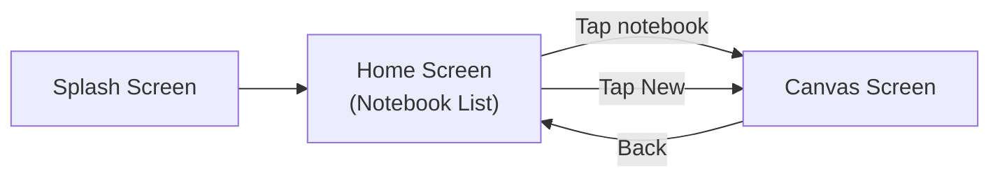

### 1.2 Route Table

| Screen | Route | Parameters | Entry Points |
|--------|-------|-----------|--------------|
| Splash | `/splash` (implicit) | None | App launch |
| Home | `/` | None | App start, back from canvas |
| Canvas | `/notebook/:id` | `id: String` (notebook UUID) | Tap notebook, create new notebook |

### 1.3 Navigation Rules

1. **Home Screen** is the root route. There is no back navigation from Home.
2. **Canvas Screen** is accessed from Home. Back navigation returns to Home.
3. **Splash Screen** is shown during Python server initialization. It is not a navigable route — it is a state-based overlay.
4. **Deep linking** is not supported in V1.
5. **System back button** (Android) on Canvas returns to Home. On Home, it exits the app.

---

## 2. User Journeys

### 2.1 Journey: First-Time User Creates and Solves

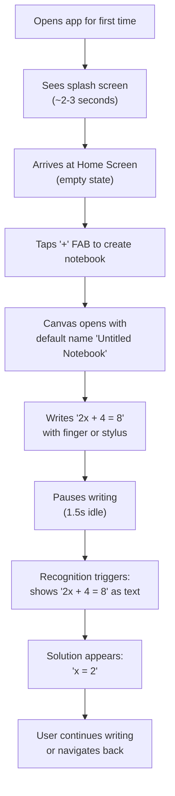

### 2.2 Journey: Student Studies with Graphs

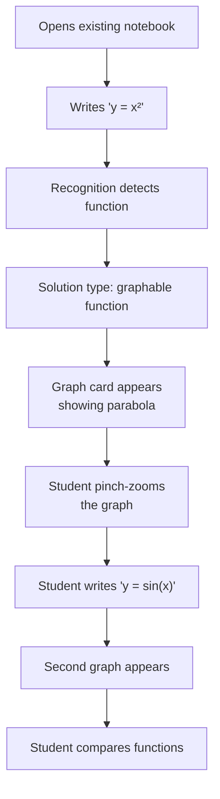

### 2.3 Journey: Engineer Uses Variables

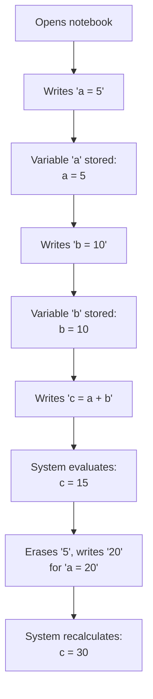

### 2.4 Journey: Notebook Management

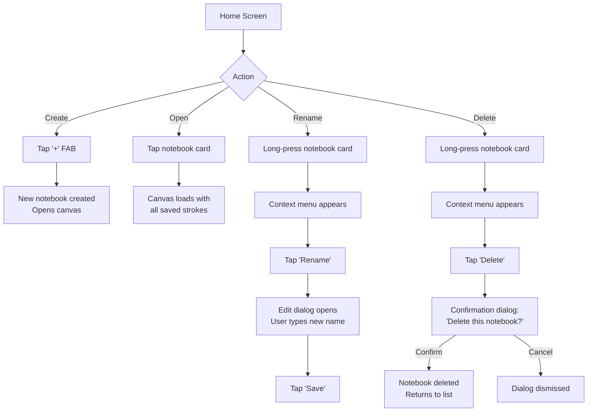

---

## 3. Screen Definitions

### 3.1 Splash Screen

| Attribute | Specification |
|-----------|--------------|
| **Purpose** | Show while Python backend initializes |
| **Duration** | Until health check returns `200 OK` (typically 2-5 seconds) |
| **Content** | App logo (centered), animated loading indicator below logo |
| **Background** | Primary gradient (see [UI_UX.md](file:///d:/MathCanvas/UI_UX.md)) |
| **Interactivity** | None — non-interactive overlay |
| **Transition** | Fade transition to Home Screen (300ms) |
| **Timeout** | If health check fails after 15 seconds, show error with "Retry" button |

### 3.2 Home Screen (Notebook List)

| Attribute | Specification |
|-----------|--------------|
| **Purpose** | Browse, create, manage notebooks |
| **App Bar** | Title: "MathCanvas", no back button |
| **Body** | Grid of notebook cards, sorted by last modified (newest first) |
| **Card Content** | Notebook name, last modified date, stroke count (subtle), thumbnail preview |
| **FAB** | "+" floating action button to create new notebook |
| **Empty State** | Illustration + "Create your first notebook" message + prominent "Create" button |
| **Long-Press** | Opens context menu (Rename, Delete) |
| **Pull-to-Refresh** | Not applicable (local data, always fresh) |
| **Settings** | Gear icon in app bar → Settings bottom sheet (theme toggle only in V1) |

### 3.3 Canvas Screen

| Attribute | Specification |
|-----------|--------------|
| **Purpose** | Main drawing and computation workspace |
| **App Bar** | Notebook name (editable on tap), back button |
| **Body** | Full-screen infinite canvas |
| **Toolbar** | Minimal floating toolbar: stroke color (black default), stroke width slider |
| **Overlays** | Recognition results, solution cards, graph cards |
| **Gestures** | See Section 3.3.1 |
| **Auto-save** | Indicator in top-right: subtle dot animation during save |
| **Status Bar** | Backend status indicator (green = ready, yellow = loading, red = error) |

#### 3.3.1 Canvas Gesture Map

| Gesture | Fingers | Action | Priority |
|---------|---------|--------|----------|
| Touch down + move | 1 (finger or stylus) | Draw stroke | Highest |
| Touch down + move | 2 | Pan canvas | High |
| Pinch | 2 | Zoom canvas | High |
| Tap | 1 | Select expression (if on recognized content) | Medium |
| Long-press | 1 | Show context menu for expression (future V1.1) | Low |

---

## 4. User Interaction Flows

### 4.1 Drawing Flow

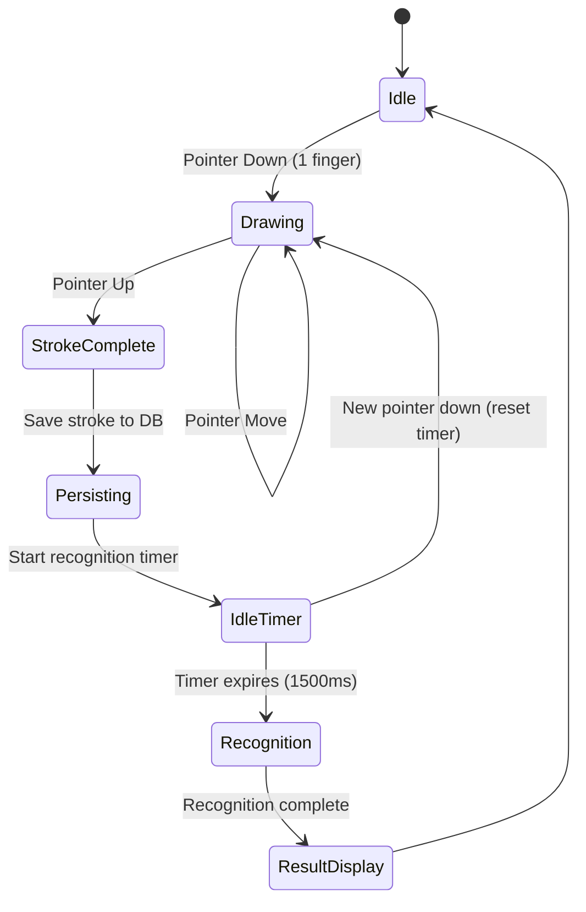

### 4.2 Pan and Zoom Flow

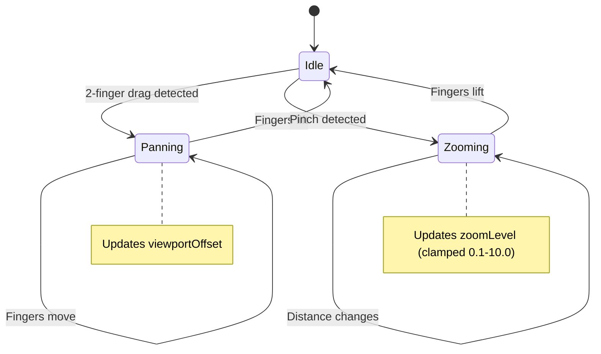

### 4.3 Recognition Flow

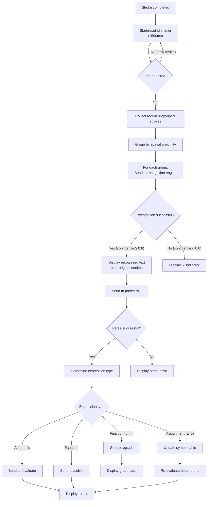

### 4.4 Real-Time Update Flow

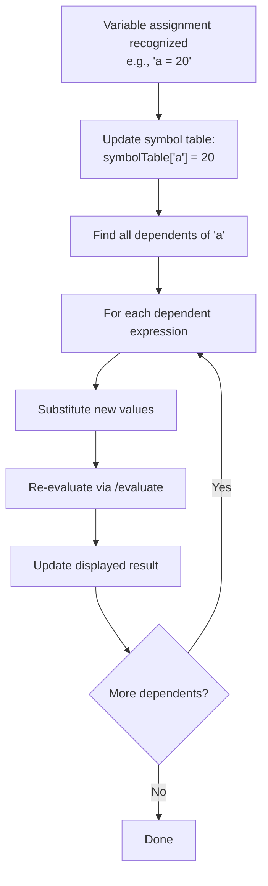

---

## 5. Error Flows

### 5.1 Backend Unavailable

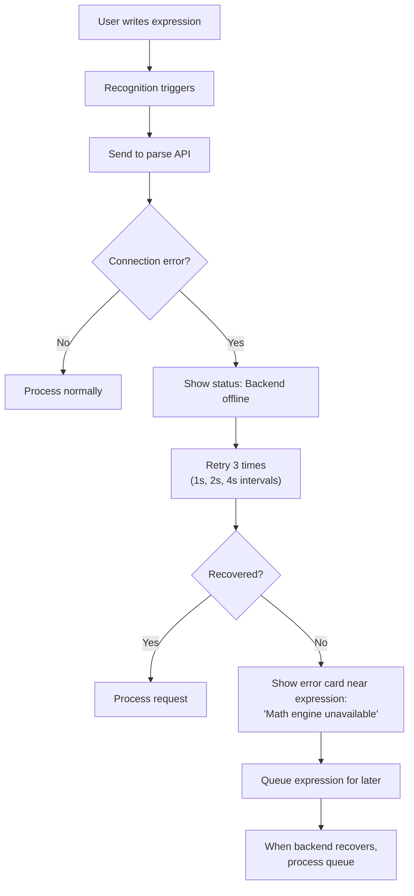

### 5.2 Recognition Failure

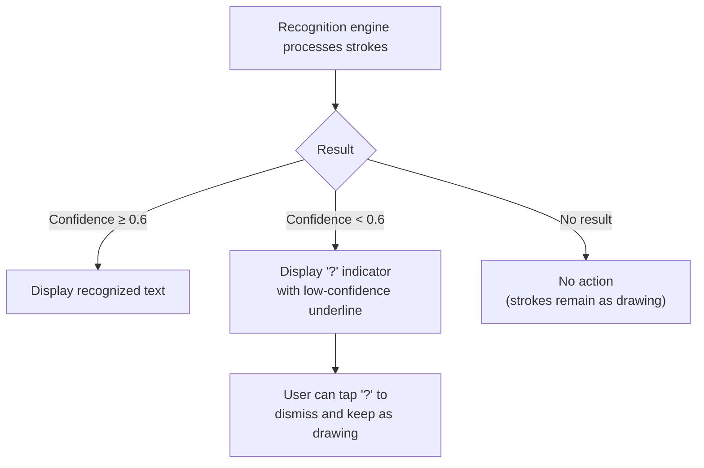

### 5.3 Computation Timeout

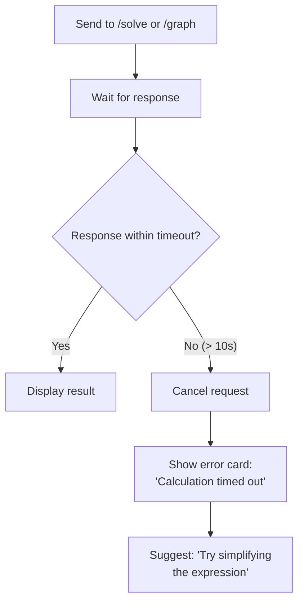

### 5.4 Database Error

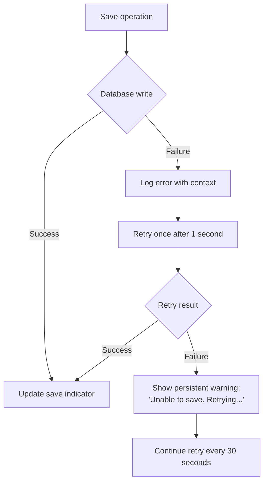

---

## 6. Empty States

### 6.1 Home Screen — No Notebooks

| Element | Specification |
|---------|--------------|
| **Illustration** | Friendly notebook/pencil illustration (generated asset) |
| **Headline** | "No notebooks yet" |
| **Body text** | "Create your first notebook to start solving math naturally." |
| **CTA button** | "Create Notebook" (same action as FAB) |
| **Layout** | Centered vertically and horizontally |

### 6.2 Canvas — Fresh Notebook

| Element | Specification |
|---------|--------------|
| **Background** | Clean grid pattern (subtle dots or lines) |
| **Hint** | Centered ghost text: "Start writing math here..." (disappears on first stroke) |
| **Toolbar** | Visible with default settings |
| **Status** | Backend status indicator visible |

### 6.3 Canvas — No Recognition Results

| Element | Specification |
|---------|--------------|
| **Behavior** | Strokes are displayed normally with no overlays |
| **Transition** | Recognition overlays appear only after successful recognition |

---

## 7. State Machines

### 7.1 Application State Machine

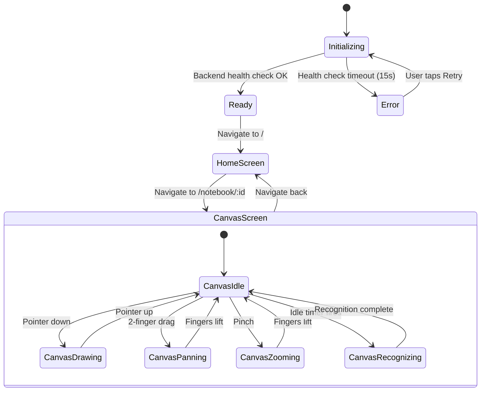

### 7.2 Stroke State Machine

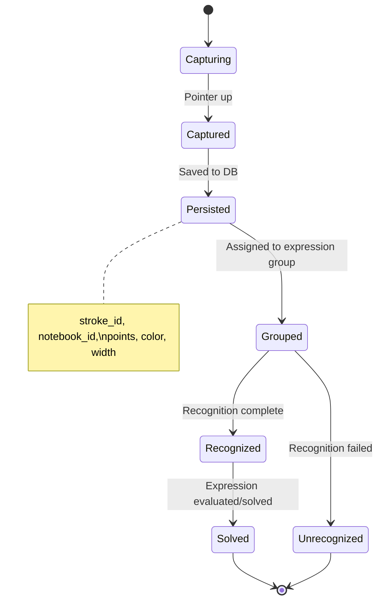

### 7.3 Expression State Machine

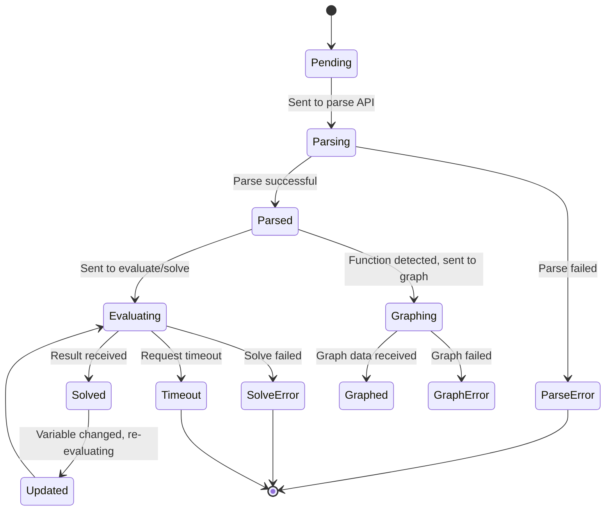

### 7.4 Backend State Machine

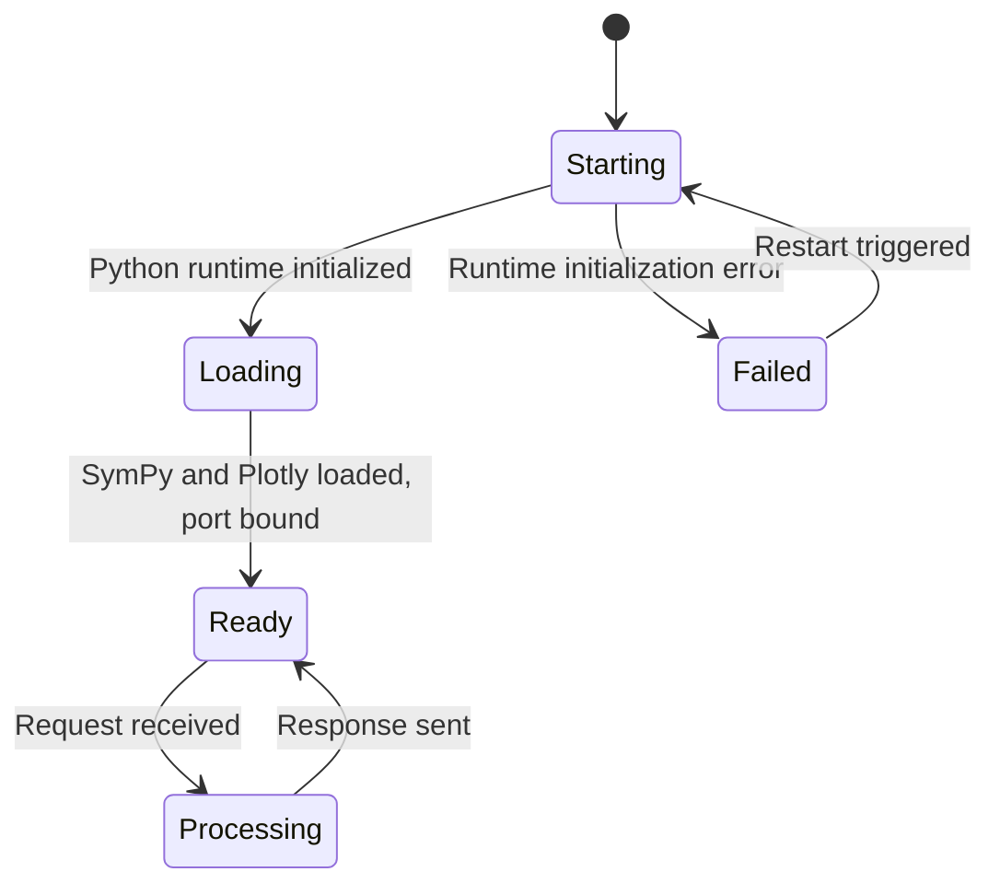

---

## 8. UX Decisions

### 8.1 Decision Log

| ID | Decision | Rationale | Alternatives Considered |
|----|----------|-----------|------------------------|
| UX-001 | Single-finger draw, two-finger pan | Matches user expectation from every drawing app. | Toolbar mode switch — rejected: adds friction. |
| UX-002 | Auto-recognition with idle timer | Eliminates explicit "recognize" action; feels magical. | Manual button — rejected: interrupts flow. |
| UX-003 | Results appear near handwriting | Contextual placement maintains spatial relationship. | Separate results panel — rejected: breaks canvas metaphor. |
| UX-004 | Graph appears as floating card on canvas | Graph is part of the mathematical context, not separate. | Full-screen graph mode — rejected: loses context. |
| UX-005 | Minimal toolbar | Canvas space is primary; tools should not dominate. | Full toolbar — rejected: clutters small screens. |
| UX-006 | Auto-save (no explicit save button) | Eliminates save anxiety; modern user expectation. | Manual save — rejected: data loss risk. |
| UX-007 | Grid background on canvas | Helps spatial orientation; familiar math paper feel. | Plain white — rejected: disorienting on infinite canvas. |
| UX-008 | Ghost hint text on empty canvas | Guides first-time users without a tutorial. | Tutorial overlay — rejected: too heavy for MVP. |
| UX-009 | Dark mode default off | Most users start in light mode; dark mode is opt-in. | Dark mode only — rejected: poor accessibility. |

---

## 9. Onboarding Flow

### 9.1 V1 Onboarding Strategy

V1 uses a **zero-friction onboarding** approach: no tutorial, no walkthrough, no account creation. The app is immediately usable.

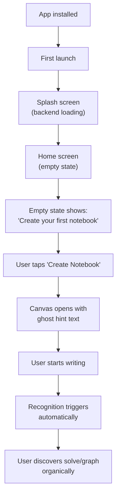

### 9.2 Discoverability Mechanisms

| Feature | Discovery Method |
|---------|-----------------|
| Create notebook | Empty state CTA + FAB |
| Drawing | Ghost hint text on empty canvas |
| Recognition | Automatic after idle period |
| Solving | Automatic after successful recognition |
| Graphing | Automatic for function expressions |
| Pan/Zoom | Natural gesture (no instruction needed) |
| Rename | Long-press on notebook card |
| Delete | Long-press context menu |
| Dark mode | Settings icon in Home app bar |

---

## 10. Notebook Flow

### 10.1 Create Notebook

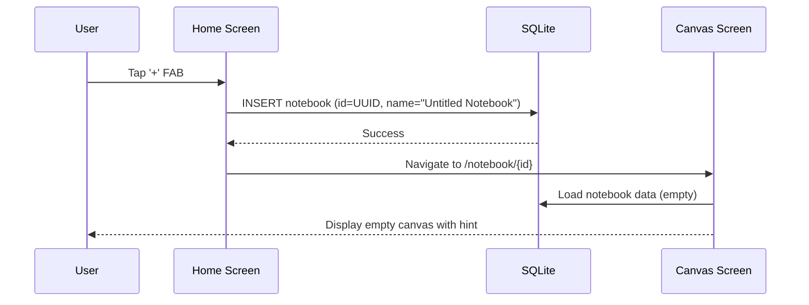

### 10.2 Open Notebook

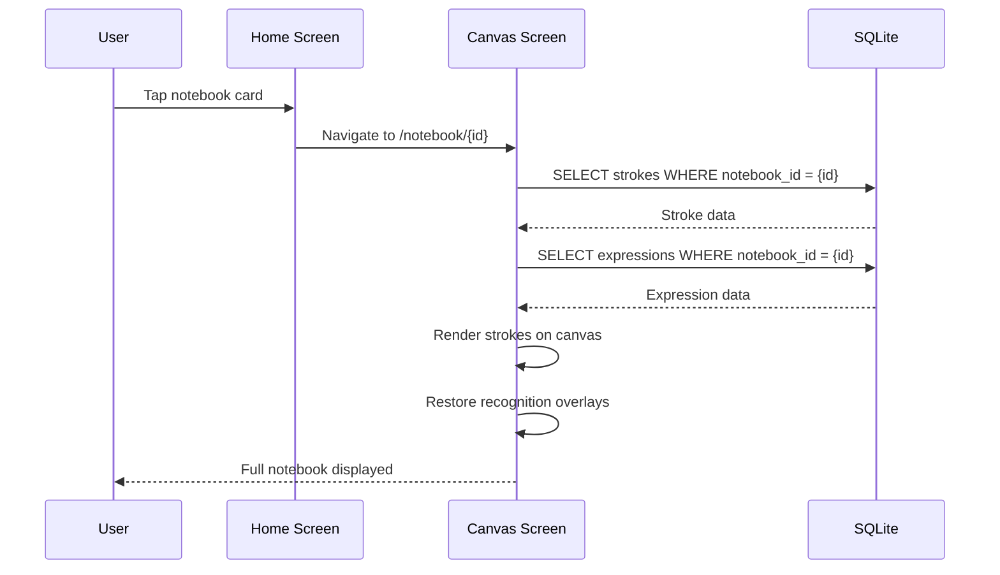

### 10.3 Rename Notebook

```mermaid
sequenceDiagram
    participant U as User
    participant H as Home Screen
    participant D as Rename Dialog
    participant DB as SQLite

    U->>H: Long-press notebook card
    H-->>U: Show context menu
    U->>H: Tap "Rename"
    H->>D: Open rename dialog (prefilled current name)
    U->>D: Type new name
    U->>D: Tap "Save"
    D->>DB: UPDATE notebook SET name = {newName} WHERE id = {id}
    DB-->>D: Success
    D->>H: Close dialog, refresh list
    H-->>U: Updated notebook card
```

### 10.4 Delete Notebook

```mermaid
sequenceDiagram
    participant U as User
    participant H as Home Screen
    participant D as Confirmation Dialog
    participant DB as SQLite

    U->>H: Long-press notebook card
    H-->>U: Show context menu
    U->>H: Tap "Delete"
    H->>D: Show confirmation dialog
    D-->>U: "Delete 'Notebook Name'? This cannot be undone."
    U->>D: Tap "Delete"
    D->>DB: DELETE expressions WHERE notebook_id = {id}
    D->>DB: DELETE strokes WHERE notebook_id = {id}
    D->>DB: DELETE notebook WHERE id = {id}
    DB-->>D: Success
    D->>H: Close dialog, refresh list
    H-->>U: Notebook removed from list
```

---

## 11. Canvas Flow

### 11.1 Canvas Initialization

```mermaid
sequenceDiagram
    participant C as Canvas Screen
    participant SM as State Manager
    participant DB as SQLite

    C->>SM: Initialize canvas state
    SM->>DB: Load strokes for notebook
    DB-->>SM: Stroke data
    SM->>DB: Load expressions for notebook
    DB-->>SM: Expression data
    SM->>DB: Load results for notebook
    DB-->>SM: Result data
    SM->>SM: Build symbol table from assignments
    SM->>SM: Compute viewport (fit all content or origin)
    SM-->>C: State ready
    C->>C: Render strokes
    C->>C: Render overlays (results, graphs)
```

### 11.2 Drawing Interaction

```mermaid
sequenceDiagram
    participant U as User
    participant GD as GestureDetector
    participant SM as State Manager
    participant CP as CustomPainter
    participant DB as SQLite

    U->>GD: Pointer down (x, y, pressure)
    GD->>SM: startStroke(point)
    SM->>SM: Create new Stroke, add first point
    SM-->>CP: Rebuild (active stroke)

    loop Pointer moves
        U->>GD: Pointer move (x, y, pressure)
        GD->>SM: addPoint(point)
        SM->>SM: Append point to active stroke
        SM-->>CP: Rebuild (updated stroke)
    end

    U->>GD: Pointer up
    GD->>SM: endStroke()
    SM->>SM: Finalize stroke
    SM->>DB: INSERT stroke
    SM->>SM: Reset/start recognition idle timer
    SM-->>CP: Rebuild (final stroke)
```

### 11.3 Pan Interaction

```mermaid
sequenceDiagram
    participant U as User
    participant GD as GestureDetector
    participant SM as State Manager
    participant CP as CustomPainter

    U->>GD: 2-finger touch down
    GD->>SM: startPan(focalPoint)
    SM->>SM: Record initial viewport offset

    loop Fingers move
        U->>GD: 2-finger move
        GD->>SM: updatePan(delta)
        SM->>SM: Update viewportOffset += delta
        SM-->>CP: Rebuild (new viewport)
    end

    U->>GD: Fingers lift
    GD->>SM: endPan()
```

### 11.4 Zoom Interaction

```mermaid
sequenceDiagram
    participant U as User
    participant GD as GestureDetector
    participant SM as State Manager
    participant CP as CustomPainter

    U->>GD: Pinch gesture start
    GD->>SM: startZoom(focalPoint, initialScale)

    loop Distance changes
        U->>GD: Pinch scale update
        GD->>SM: updateZoom(scale, focalPoint)
        SM->>SM: zoomLevel = clamp(baseZoom * scale, 0.1, 10.0)
        SM->>SM: Adjust viewportOffset to zoom around focal point
        SM-->>CP: Rebuild (new zoom)
    end

    U->>GD: Fingers lift
    GD->>SM: endZoom()
```

---

## 12. Recognition Flow

### 12.1 End-to-End Recognition

```mermaid
sequenceDiagram
    participant Timer as Idle Timer
    participant SM as State Manager
    participant RE as Recognition Engine
    participant API as FastAPI
    participant ME as Math Engine

    Timer->>SM: Idle period elapsed (1500ms)
    SM->>SM: Collect ungrouped strokes
    SM->>SM: Group by spatial proximity
    SM->>RE: recognize(strokeGroup)
    RE-->>SM: RecognitionResult {latex, confidence, bbox}

    alt Confidence ≥ 0.6
        SM->>SM: Store recognized expression
        SM->>API: POST /api/v1/parse {expression: latex}
        API-->>SM: Parsed expression

        alt Arithmetic expression
            SM->>API: POST /api/v1/evaluate {expression}
            API->>ME: evaluate(expression)
            ME-->>API: Result
            API-->>SM: {value: "14", latex: "14"}
            SM->>SM: Display result near expression
        else Equation
            SM->>API: POST /api/v1/solve {expression, variables}
            API->>ME: solve(expression)
            ME-->>API: Solutions
            API-->>SM: {solutions: [{variable: "x", value: "2"}]}
            SM->>SM: Display solution near expression
        else Function (y = ...)
            SM->>API: POST /api/v1/graph {expression}
            API-->>SM: Graph data
            SM->>SM: Display graph card
        else Variable assignment (a = 5)
            SM->>SM: Update symbol table
            SM->>SM: Re-evaluate dependents
        end
    else Confidence < 0.6
        SM->>SM: Display "?" indicator
    end
```

---

## 13. Graph Flow

### 13.1 Graph Generation

```mermaid
sequenceDiagram
    participant SM as State Manager
    participant API as FastAPI
    participant GE as Graph Engine
    participant UI as Graph Card Widget

    SM->>API: POST /api/v1/graph
    Note right of SM: expression: "x**2 - 4"<br/>variable: "x"<br/>x_range: [-10, 10]<br/>output_format: "data"

    API->>GE: generate_graph(expression, range)
    GE->>GE: Evaluate expression at 500 points
    GE->>GE: Create Plotly figure
    GE-->>API: Graph data (x[], y[], metadata)
    API-->>SM: GraphResult

    SM->>UI: Display graph card
    UI->>UI: Render plot using CustomPainter
    UI-->>SM: Graph interactive (pan, zoom)
```

### 13.2 Graph Interaction

```mermaid
stateDiagram-v2
    [*] --> Displayed
    Displayed --> Panning: Drag on graph
    Panning --> Displayed: Release
    Displayed --> Zooming: Pinch on graph
    Zooming --> Displayed: Release
    Displayed --> Inspecting: Tap on graph
    Inspecting --> Displayed: Tap elsewhere
    
    note right of Inspecting: Shows (x, y) value\nat tap point
```

### 13.3 Graph Update on Expression Change

```mermaid
sequenceDiagram
    participant U as User
    participant SM as State Manager
    participant API as FastAPI
    participant GC as Graph Card

    U->>SM: Modifies graphed expression
    SM->>SM: Recognition triggers for modified strokes
    SM->>SM: Detect expression change
    SM->>API: POST /api/v1/graph (new expression)
    API-->>SM: New graph data
    SM->>GC: Update graph with new data
    GC->>GC: Animate transition to new graph
    GC-->>U: Updated graph displayed
```

---

## 14. Save and Restore Flow

### 14.1 Auto-Save Flow

```mermaid
sequenceDiagram
    participant Timer as 30s Timer
    participant SM as State Manager
    participant DB as SQLite
    participant UI as Save Indicator

    loop Every 30 seconds
        Timer->>SM: Auto-save triggered
        SM->>SM: Collect dirty (unsaved) data
        SM->>UI: Show saving indicator
        SM->>DB: Batch INSERT/UPDATE strokes
        SM->>DB: Batch INSERT/UPDATE expressions
        SM->>DB: Batch INSERT/UPDATE results
        SM->>DB: UPDATE notebook.updated_at
        DB-->>SM: All writes complete
        SM->>UI: Hide saving indicator
    end
```

### 14.2 App Lifecycle Save

```mermaid
flowchart TD
    A["App lifecycle event"] --> B{Event type}
    B -->|"onPause / onInactive"| C["Trigger immediate save"]
    B -->|"onResume"| D["Verify data integrity"]
    B -->|"onDetach"| E["Final save attempt"]

    C --> F["Save all dirty data"]
    F --> G["Mark save timestamp"]

    D --> H["Compare in-memory with DB"]
    H --> I{Consistent?}
    I -->|"Yes"| J["Continue"]
    I -->|"No"| K["Reload from DB"]
```

### 14.3 Notebook Restore Flow

```mermaid
sequenceDiagram
    participant C as Canvas Screen
    participant DB as SQLite
    participant SM as State Manager

    C->>DB: SELECT * FROM notebooks WHERE id = ?
    DB-->>C: Notebook metadata

    C->>DB: SELECT * FROM strokes WHERE notebook_id = ? ORDER BY created_at
    DB-->>C: All strokes

    C->>DB: SELECT * FROM expressions WHERE notebook_id = ?
    DB-->>C: All expressions

    C->>DB: SELECT * FROM results WHERE expression_id IN (...)
    DB-->>C: All results

    C->>SM: Initialize canvas state with loaded data
    SM->>SM: Rebuild stroke spatial index
    SM->>SM: Rebuild symbol table from assignments
    SM->>SM: Compute initial viewport
    SM-->>C: Canvas ready for display
```

---

## 15. Settings Flow

### 15.1 Settings Access

```mermaid
flowchart TD
    A["Home Screen"] --> B["Tap gear icon in app bar"]
    B --> C["Settings bottom sheet opens"]
    C --> D["Theme toggle:<br/>Light / Dark / System"]
    D --> E["Selection saved to SharedPreferences"]
    E --> F["Theme applied immediately"]
    C --> G["Close sheet<br/>(drag down or tap outside)"]
```

### 15.2 V1 Settings

| Setting | Type | Options | Default | Storage |
|---------|------|---------|---------|---------|
| Theme Mode | Toggle | Light / Dark / System | System | SharedPreferences |

---

## 16. Interaction Timing Specifications

| Interaction | Expected Duration | User Perception |
|------------|-------------------|-----------------|
| Stroke render | < 16ms | Instantaneous |
| Canvas pan/zoom | < 16ms per frame | Smooth |
| Recognition trigger | 1500ms after last stroke | Natural pause |
| Recognition processing | 200-500ms | Brief |
| Parse API call | 50-100ms | Imperceptible |
| Evaluate API call | 100-200ms | Brief |
| Solve API call | 200-1000ms | Noticeable but acceptable |
| Graph API call | 500-2000ms | Loading indicator shown |
| Auto-save | < 100ms | Imperceptible (background) |
| Notebook load (1000 strokes) | < 500ms | Brief splash |
| Notebook load (10000 strokes) | < 2000ms | Loading indicator |

---

*End of AppFlow.md*
