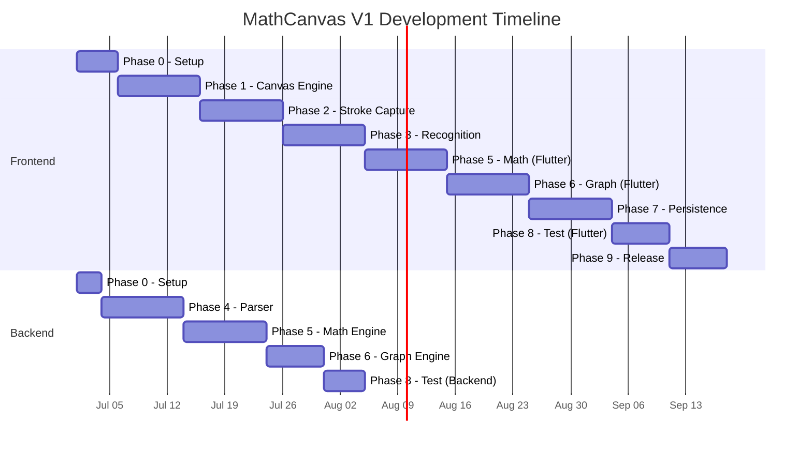
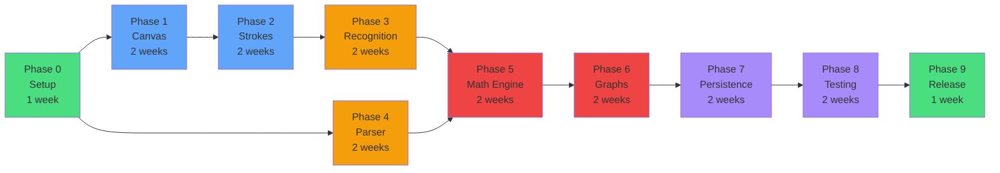

# MathCanvas — Implementation Plan

**Version:** 1.0
**Status:** Approved
**Last Updated:** 2026-06-12
**Owner:** Engineering
**Audience:** AI Coding Agents, Engineering
**References:** [PRD.md](file:///d:/MathCanvas/PRD.md), [TRD.md](file:///d:/MathCanvas/TRD.md), [Schema.md](file:///d:/MathCanvas/Schema.md), [Structure.md](file:///d:/MathCanvas/Structure.md)

---

## Phase 0 — Project Initialization

### Goals

Establish the development environment, repository structure, CI configuration, and all foundational tooling required for parallel development by multiple AI agents.

### Deliverables

- Flutter project with configured dependencies
- FastAPI project with configured dependencies
- Repository structure matching [Structure.md](file:///d:/MathCanvas/Structure.md)
- Documentation files committed
- Development environment scripts
- CI/CD configuration (lint, format, test runners)

### Tasks

| ID | Task | Estimated Hours | Owner |
|----|------|----------------|-------|
| P0-01 | Create Flutter project (`flutter create`) | 1 | Agent-Frontend |
| P0-02 | Configure `pubspec.yaml` with all V1 dependencies | 1 | Agent-Frontend |
| P0-03 | Set up folder structure per [Structure.md](file:///d:/MathCanvas/Structure.md) | 2 | Agent-Frontend |
| P0-04 | Configure Riverpod with `ProviderScope` in `main.dart` | 1 | Agent-Frontend |
| P0-05 | Configure GoRouter with initial routes (Home, Canvas) | 1 | Agent-Frontend |
| P0-06 | Set up theme system (light/dark) per [UI_UX.md](file:///d:/MathCanvas/UI_UX.md) | 2 | Agent-Frontend |
| P0-07 | Create FastAPI project with folder structure | 1 | Agent-Backend |
| P0-08 | Configure `requirements.txt` with all dependencies | 0.5 | Agent-Backend |
| P0-09 | Create FastAPI `main.py` with health endpoint | 1 | Agent-Backend |
| P0-10 | Set up Python logging configuration | 0.5 | Agent-Backend |
| P0-11 | Create `.gitignore` for Flutter + Python | 0.5 | Agent-DevOps |
| P0-12 | Create `README.md` with setup instructions | 1 | Agent-Docs |
| P0-13 | Set up `analysis_options.yaml` (Dart lint rules) | 0.5 | Agent-Frontend |
| P0-14 | Set up `pyproject.toml` or linting config (Python) | 0.5 | Agent-Backend |
| P0-15 | Verify `flutter run` works on Android emulator | 1 | Agent-Frontend |
| P0-16 | Verify `uvicorn main:app` starts and health check passes | 0.5 | Agent-Backend |
| P0-17 | Create shared constants file (API port, URLs) | 0.5 | Agent-Frontend |

### Dependencies

- None (this is the first phase)

### Risks

| Risk | Probability | Mitigation |
|------|------------|-----------|
| Flutter SDK version incompatibility | Low | Pin SDK version in documentation |
| Python environment conflicts | Medium | Use virtual environment; document Python version |

### Acceptance Criteria

- [ ] `flutter analyze` passes with zero warnings
- [ ] `flutter test` runs (even with no tests)
- [ ] `uvicorn main:app --host 127.0.0.1 --port 8400` starts successfully
- [ ] `GET /health` returns `{"status": "ready"}`
- [ ] All folders from [Structure.md](file:///d:/MathCanvas/Structure.md) exist
- [ ] All documentation files are committed

---

## Phase 1 — Canvas Engine

### Goals

Build the infinite canvas with pan, zoom, and a world-coordinate system. This is the foundational rendering system on which all other visual features are built.

### Deliverables

- `CanvasWidget` with `CustomPainter`
- Viewport transformation (world ↔ screen coordinates)
- Pan gesture handling (two-finger)
- Zoom gesture handling (pinch-to-zoom)
- Grid background rendering
- Canvas state management via Riverpod

### Tasks

| ID | Task | Estimated Hours | Owner |
|----|------|----------------|-------|
| P1-01 | Create `CanvasState` freezed model | 2 | Agent-Frontend |
| P1-02 | Create `CanvasStateNotifier` (Riverpod) | 3 | Agent-Frontend |
| P1-03 | Implement coordinate transformation matrix | 3 | Agent-Frontend |
| P1-04 | Create `CanvasBackgroundPainter` (grid dots/lines) | 2 | Agent-Frontend |
| P1-05 | Create `CanvasWidget` with `CustomPainter` | 4 | Agent-Frontend |
| P1-06 | Implement `GestureDetector` for pan (two-finger) | 3 | Agent-Frontend |
| P1-07 | Implement `GestureDetector` for zoom (pinch) | 3 | Agent-Frontend |
| P1-08 | Implement zoom focal point calculation | 2 | Agent-Frontend |
| P1-09 | Add zoom level clamping (0.1 – 10.0) | 0.5 | Agent-Frontend |
| P1-10 | Create `CanvasScreen` scaffold with toolbar placeholder | 2 | Agent-Frontend |
| P1-11 | Write unit tests for coordinate transformation | 3 | Agent-Frontend |
| P1-12 | Write widget tests for pan/zoom gestures | 3 | Agent-Frontend |
| P1-13 | Performance test: verify 60fps during pan/zoom | 2 | Agent-Frontend |

### Dependencies

- Phase 0 complete

### Risks

| Risk | Probability | Mitigation |
|------|------------|-----------|
| Gesture conflict between draw and pan | Medium | Use pointer count to distinguish 1-finger (draw) from 2-finger (pan) |
| Zoom jitter at extreme scales | Low | Clamp zoom level; use double precision |

### Acceptance Criteria

- [ ] Canvas pans smoothly with two-finger drag
- [ ] Canvas zooms smoothly with pinch gesture
- [ ] Zoom centers on focal point between fingers
- [ ] Grid background renders and transforms with canvas
- [ ] Pan/zoom maintains 60fps on reference device
- [ ] World-to-screen and screen-to-world coordinate conversions are correct
- [ ] Unit tests pass for all transformation logic

---

## Phase 2 — Stroke Capture System

### Goals

Implement stroke capture, rendering, and persistence. Users must be able to draw with finger or stylus and see strokes rendered in real time with pressure sensitivity.

### Deliverables

- `Stroke` and `StrokePoint` domain models
- Single-finger stroke capture via `Listener` or `GestureDetector`
- Pressure-sensitive stroke rendering
- Palm rejection (when stylus is active)
- Stroke persistence to SQLite
- Stroke loading and rendering on canvas

### Tasks

| ID | Task | Estimated Hours | Owner |
|----|------|----------------|-------|
| P2-01 | Create `Stroke` and `StrokePoint` freezed models | 1 | Agent-Frontend |
| P2-02 | Create `StrokeEntity` database model | 1 | Agent-Frontend |
| P2-03 | Implement `StrokePainter` (CustomPainter for strokes) | 4 | Agent-Frontend |
| P2-04 | Implement pressure-sensitive stroke width | 2 | Agent-Frontend |
| P2-05 | Implement stroke capture in `GestureDetector` / `Listener` | 3 | Agent-Frontend |
| P2-06 | Differentiate 1-finger (draw) from 2-finger (pan) | 2 | Agent-Frontend |
| P2-07 | Implement palm rejection (ignore non-stylus when stylus active) | 2 | Agent-Frontend |
| P2-08 | Implement SQLite database initialization | 3 | Agent-Frontend |
| P2-09 | Implement `StrokeDao` and `StrokeRepository` | 3 | Agent-Frontend |
| P2-10 | Implement stroke persistence (save on pointer-up) | 2 | Agent-Frontend |
| P2-11 | Implement stroke loading on notebook open | 2 | Agent-Frontend |
| P2-12 | Implement bounding box calculation for strokes | 1 | Agent-Frontend |
| P2-13 | Implement viewport culling (only render visible strokes) | 3 | Agent-Frontend |
| P2-14 | Write unit tests for stroke models | 2 | Agent-Frontend |
| P2-15 | Write integration tests for stroke persistence | 3 | Agent-Frontend |
| P2-16 | Write widget tests for stroke rendering | 2 | Agent-Frontend |
| P2-17 | Performance test: 60fps during active drawing | 2 | Agent-Frontend |

### Dependencies

- Phase 0 complete (database)
- Phase 1 complete (canvas, coordinate system)

### Risks

| Risk | Probability | Mitigation |
|------|------------|-----------|
| Stroke rendering slows with many strokes | Medium | Viewport culling, batch rendering, spatial index |
| Points JSON becomes very large | Medium | Limit points per stroke; consider binary format later |
| Pressure API varies by device | High | Default to 1.0 if pressure unavailable |

### Acceptance Criteria

- [ ] Single-finger drawing produces smooth strokes
- [ ] Stylus drawing captures pressure data
- [ ] Stroke width varies with pressure
- [ ] Palm rejection works when stylus is detected
- [ ] Strokes persist to SQLite and survive app restart
- [ ] Loading a notebook renders all saved strokes
- [ ] Only viewport-visible strokes are rendered
- [ ] Drawing maintains 60fps with 1000+ stored strokes
- [ ] All tests pass

---

## Phase 3 — Recognition Layer

### Goals

Implement the handwriting recognition pipeline: stroke grouping, recognition engine interface, and initial recognizer implementation.

### Deliverables

- Recognition engine abstract interface
- Stroke grouping algorithm (spatial proximity)
- Idle timer for recognition trigger
- V1 recognition implementation (TFLite or rule-based)
- Recognition result display on canvas
- Confidence indicator

### Tasks

| ID | Task | Estimated Hours | Owner |
|----|------|----------------|-------|
| P3-01 | Define `RecognitionEngine` abstract interface | 1 | Agent-Frontend |
| P3-02 | Define `RecognitionResult` model | 1 | Agent-Frontend |
| P3-03 | Implement stroke grouping algorithm (spatial clustering) | 4 | Agent-Frontend |
| P3-04 | Implement idle timer (configurable, default 1500ms) | 2 | Agent-Frontend |
| P3-05 | Implement V1 recognition engine | 8 | Agent-Frontend |
| P3-06 | Integrate TFLite model for symbol recognition | 6 | Agent-Frontend |
| P3-07 | Implement spatial layout analysis (detect superscript, fraction) | 5 | Agent-Frontend |
| P3-08 | Implement expression assembly from recognized symbols | 4 | Agent-Frontend |
| P3-09 | Create `RecognitionOverlayPainter` (display recognized text) | 3 | Agent-Frontend |
| P3-10 | Implement confidence indicator (show "?" for low confidence) | 1 | Agent-Frontend |
| P3-11 | Create `RecognitionStateNotifier` (Riverpod) | 2 | Agent-Frontend |
| P3-12 | Implement `ExpressionDao` and `ExpressionRepository` | 2 | Agent-Frontend |
| P3-13 | Implement `ExpressionStrokeDao` | 1 | Agent-Frontend |
| P3-14 | Write unit tests for stroke grouping | 3 | Agent-Frontend |
| P3-15 | Write unit tests for recognition engine | 4 | Agent-Frontend |
| P3-16 | Write integration tests for recognition pipeline | 3 | Agent-Frontend |

### Dependencies

- Phase 2 complete (strokes)

### Risks

| Risk | Probability | Mitigation |
|------|------------|-----------|
| Recognition accuracy is too low | High | Start with limited symbol set; iterate; modular interface allows replacement |
| TFLite model is too large | Medium | Use quantized model; start with simpler model |
| Stroke grouping produces wrong boundaries | Medium | Tune clustering threshold; allow manual correction later |

### Acceptance Criteria

- [ ] Recognition triggers automatically after 1500ms idle
- [ ] Numbers and basic operators are recognized with ≥ 80% accuracy
- [ ] Variables (single letters) are recognized
- [ ] Recognized text appears near handwriting
- [ ] Low-confidence results show "?" indicator
- [ ] Recognition engine interface is abstract and replaceable
- [ ] Expressions are persisted to SQLite
- [ ] All tests pass

---

## Phase 4 — Expression Parser

### Goals

Build the expression parsing API endpoint that converts recognized LaTeX strings into SymPy-compatible expressions and determines expression type.

### Deliverables

- FastAPI parse endpoint (`POST /api/v1/parse`)
- Expression parser (LaTeX to SymPy conversion)
- Expression type classification
- Error handling for malformed expressions
- Parser unit tests

### Tasks

| ID | Task | Estimated Hours | Owner |
|----|------|----------------|-------|
| P4-01 | Create Pydantic request/response models for parse endpoint | 1 | Agent-Backend |
| P4-02 | Implement LaTeX to SymPy expression converter | 4 | Agent-Backend |
| P4-03 | Implement expression type classifier | 3 | Agent-Backend |
| P4-04 | Implement `POST /api/v1/parse` route | 2 | Agent-Backend |
| P4-05 | Implement error handling for malformed expressions | 2 | Agent-Backend |
| P4-06 | Implement input sanitization (prevent code injection) | 2 | Agent-Backend |
| P4-07 | Create Flutter API client for parse endpoint | 2 | Agent-Frontend |
| P4-08 | Integrate parse API call into recognition pipeline | 2 | Agent-Frontend |
| P4-09 | Write unit tests for expression parser | 4 | Agent-Backend |
| P4-10 | Write unit tests for type classifier | 2 | Agent-Backend |
| P4-11 | Write integration tests for parse API | 2 | Agent-Backend |
| P4-12 | Write Flutter tests for API client | 2 | Agent-Frontend |

### Dependencies

- Phase 0 (backend project setup)
- Phase 3 complete (provides recognized LaTeX input)

### Risks

| Risk | Probability | Mitigation |
|------|------------|-----------|
| LaTeX from recognition is non-standard | High | Build flexible parser that handles common variations |
| Expression classification is ambiguous | Medium | Use heuristics (contains '=' → equation; 'y =' → function) |

### Acceptance Criteria

- [ ] `POST /api/v1/parse` accepts LaTeX and returns SymPy string + type
- [ ] All V1 expression types correctly classified: arithmetic, equation, function, assignment, expression
- [ ] Malformed expressions return structured error with position info
- [ ] No raw `eval()` or unsafe Python execution
- [ ] Parser handles: `2x + 4 = 8`, `y = x^2`, `sin(x)`, `x^3 + 2x + 1`, `a = 5`
- [ ] All tests pass

---

## Phase 5 — Math Engine

### Goals

Implement the mathematical computation engine using SymPy, exposed via FastAPI endpoints for evaluation, solving, and simplification.

### Deliverables

- `POST /api/v1/evaluate` endpoint
- `POST /api/v1/solve` endpoint
- `POST /api/v1/simplify` endpoint
- SymPy solver wrapper with timeout
- Result caching
- Flutter API client integration
- Symbol table management (variables)
- Dependency tracking and propagation

### Tasks

| ID | Task | Estimated Hours | Owner |
|----|------|----------------|-------|
| P5-01 | Implement SymPy solver wrapper (`engine/solver.py`) | 4 | Agent-Backend |
| P5-02 | Implement arithmetic evaluation endpoint | 2 | Agent-Backend |
| P5-03 | Implement algebraic solving endpoint | 3 | Agent-Backend |
| P5-04 | Implement symbolic simplification endpoint | 2 | Agent-Backend |
| P5-05 | Implement computation timeout (10s max) | 1 | Agent-Backend |
| P5-06 | Implement LaTeX output for results | 2 | Agent-Backend |
| P5-07 | Implement result caching (expression hash → result) | 2 | Agent-Backend |
| P5-08 | Create Pydantic models for solve/evaluate/simplify | 1 | Agent-Backend |
| P5-09 | Create Flutter API client for math endpoints | 2 | Agent-Frontend |
| P5-10 | Create `MathStateNotifier` (Riverpod) | 3 | Agent-Frontend |
| P5-11 | Implement symbol table (variable storage in state) | 2 | Agent-Frontend |
| P5-12 | Implement dependency tracking (which expressions use which variables) | 3 | Agent-Frontend |
| P5-13 | Implement dependency propagation (re-evaluate on variable change) | 3 | Agent-Frontend |
| P5-14 | Implement `ResultDao` and `ResultRepository` | 2 | Agent-Frontend |
| P5-15 | Implement `VariableDao` and `VariableRepository` | 2 | Agent-Frontend |
| P5-16 | Create result display overlay on canvas | 3 | Agent-Frontend |
| P5-17 | Write unit tests for solver wrapper | 4 | Agent-Backend |
| P5-18 | Write API integration tests | 3 | Agent-Backend |
| P5-19 | Write unit tests for symbol table and dependency tracking | 3 | Agent-Frontend |
| P5-20 | Write integration tests for end-to-end solve flow | 3 | Agent-Frontend |

### Dependencies

- Phase 4 complete (expression parser)

### Risks

| Risk | Probability | Mitigation |
|------|------------|-----------|
| SymPy is slow for complex expressions | Medium | Implement timeout; cache results; limit complexity |
| Dependency propagation creates infinite loops | Low | Detect circular dependencies; limit propagation depth |
| Memory usage grows with large symbol tables | Low | Limit variables per notebook; garbage collect unused |

### Acceptance Criteria

- [ ] `2 + 3 * 4` evaluates to `14`
- [ ] `2x + 4 = 8` solves to `x = 2`
- [ ] `x^2 + 2x + 1` simplifies to `(x + 1)^2`
- [ ] `sin(pi/4)` evaluates to `0.7071...`
- [ ] Results display near their source expression on canvas
- [ ] Variables (`a = 5`) are stored in symbol table
- [ ] Changing a variable re-evaluates dependent expressions
- [ ] Computation timeout at 10 seconds
- [ ] All tests pass

---

## Phase 6 — Graph Engine

### Goals

Implement graph generation using Plotly and display interactive graphs on the canvas.

### Deliverables

- `POST /api/v1/graph` endpoint
- Plotly graph generator
- Graph display widget (CustomPainter-based chart)
- Graph interaction (pan, zoom within graph)
- Graph update on expression change
- Graph persistence

### Tasks

| ID | Task | Estimated Hours | Owner |
|----|------|----------------|-------|
| P6-01 | Implement Plotly graph generator (`engine/grapher.py`) | 4 | Agent-Backend |
| P6-02 | Implement `POST /api/v1/graph` route | 2 | Agent-Backend |
| P6-03 | Support data and HTML output formats | 2 | Agent-Backend |
| P6-04 | Implement graph styling (colors, grid, axes) | 2 | Agent-Backend |
| P6-05 | Create Flutter API client for graph endpoint | 1 | Agent-Frontend |
| P6-06 | Create `GraphChartPainter` (CustomPainter for native graph rendering) | 6 | Agent-Frontend |
| P6-07 | Implement graph axes, labels, and grid lines | 3 | Agent-Frontend |
| P6-08 | Implement graph card widget (draggable on canvas) | 3 | Agent-Frontend |
| P6-09 | Implement graph interaction (pan/zoom within graph) | 3 | Agent-Frontend |
| P6-10 | Implement graph value inspection (tap to see x,y) | 2 | Agent-Frontend |
| P6-11 | Create `GraphStateNotifier` (Riverpod) | 2 | Agent-Frontend |
| P6-12 | Implement `GraphDao` and `GraphRepository` | 2 | Agent-Frontend |
| P6-13 | Implement graph persistence | 1 | Agent-Frontend |
| P6-14 | Implement graph update on expression change | 2 | Agent-Frontend |
| P6-15 | WebView fallback for Plotly HTML rendering | 3 | Agent-Frontend |
| P6-16 | Write unit tests for graph generator | 3 | Agent-Backend |
| P6-17 | Write API integration tests | 2 | Agent-Backend |
| P6-18 | Write widget tests for graph card | 3 | Agent-Frontend |
| P6-19 | Performance test: graph generation under 3 seconds | 1 | Agent-Backend |

### Dependencies

- Phase 4 complete (expression parser)
- Phase 5 complete (math engine, for expression evaluation context)

### Risks

| Risk | Probability | Mitigation |
|------|------------|-----------|
| Plotly HTML is too heavy for mobile WebView | Medium | Use data format with native CustomPainter rendering as primary |
| Graph rendering is slow | Low | Limit data points; use efficient path drawing |
| Graph interaction conflicts with canvas gestures | Medium | Isolate graph gesture detection within graph card bounds |

### Acceptance Criteria

- [ ] Writing `y = x^2` produces a parabola graph on canvas
- [ ] Graph supports linear, quadratic, polynomial, trigonometric functions
- [ ] Graph card can be panned and zoomed independently
- [ ] Tapping on graph shows (x, y) value at that point
- [ ] Changing a graphed expression updates the graph within 1 second
- [ ] Graph data persists and restores with notebook
- [ ] Graph generation completes in < 3 seconds
- [ ] All tests pass

---

## Phase 7 — Persistence Layer

### Goals

Complete the full data persistence system: auto-save, notebook management (create, rename, delete, open), and state restoration.

### Deliverables

- Complete notebook CRUD operations
- Auto-save system (30-second interval + lifecycle events)
- Notebook list screen (Home)
- State restoration on notebook open
- Settings persistence (theme)
- Save indicator UI

### Tasks

| ID | Task | Estimated Hours | Owner |
|----|------|----------------|-------|
| P7-01 | Implement `NotebookDao` and `NotebookRepository` | 2 | Agent-Frontend |
| P7-02 | Implement `NotebookStateNotifier` (Riverpod) | 2 | Agent-Frontend |
| P7-03 | Create Home Screen (notebook list) | 4 | Agent-Frontend |
| P7-04 | Create notebook card widget | 2 | Agent-Frontend |
| P7-05 | Implement create notebook flow | 1 | Agent-Frontend |
| P7-06 | Implement rename notebook flow (long-press + dialog) | 2 | Agent-Frontend |
| P7-07 | Implement delete notebook flow (long-press + confirmation) | 2 | Agent-Frontend |
| P7-08 | Implement auto-save timer (30-second interval) | 2 | Agent-Frontend |
| P7-09 | Implement lifecycle save (onPause, onInactive, onDetach) | 2 | Agent-Frontend |
| P7-10 | Implement save indicator in canvas toolbar | 1 | Agent-Frontend |
| P7-11 | Implement full state restoration on notebook open | 3 | Agent-Frontend |
| P7-12 | Implement viewport state persistence (position, zoom) | 1 | Agent-Frontend |
| P7-13 | Implement empty state (Home Screen, no notebooks) | 1 | Agent-Frontend |
| P7-14 | Implement empty state (Canvas, fresh notebook hint) | 1 | Agent-Frontend |
| P7-15 | Implement theme toggle (Settings bottom sheet) | 2 | Agent-Frontend |
| P7-16 | Implement SharedPreferences for settings | 1 | Agent-Frontend |
| P7-17 | Write unit tests for notebook CRUD | 3 | Agent-Frontend |
| P7-18 | Write integration tests for auto-save | 3 | Agent-Frontend |
| P7-19 | Write integration tests for full state restoration | 3 | Agent-Frontend |
| P7-20 | Write widget tests for Home Screen | 3 | Agent-Frontend |

### Dependencies

- Phase 2 complete (stroke persistence)
- Phase 3 complete (expression persistence)
- Phase 5 complete (result and variable persistence)
- Phase 6 complete (graph persistence)

### Risks

| Risk | Probability | Mitigation |
|------|------------|-----------|
| Auto-save causes UI jank | Medium | Save on background isolate; batch writes |
| State restoration is incomplete | Medium | Comprehensive integration tests |
| Large notebooks slow to load | Low | Lazy loading; progressive rendering |

### Acceptance Criteria

- [ ] Creating a notebook opens a new empty canvas
- [ ] Renaming updates the notebook card and app bar title
- [ ] Deleting removes notebook and all data after confirmation
- [ ] Opening a notebook restores all strokes, expressions, results, graphs
- [ ] Auto-save triggers every 30 seconds
- [ ] App lifecycle events trigger save
- [ ] Save indicator shows during save operations
- [ ] Viewport position and zoom restore on reopen
- [ ] Empty states display correctly
- [ ] Theme toggle works and persists
- [ ] All tests pass

---

## Phase 8 — Testing

### Goals

Comprehensive testing across all components. Achieve target test coverage and validate all acceptance criteria from previous phases.

### Deliverables

- Complete unit test suite (frontend)
- Complete unit test suite (backend)
- Integration test suite
- Widget test suite
- Performance test results
- Test coverage report

### Tasks

| ID | Task | Estimated Hours | Owner |
|----|------|----------------|-------|
| P8-01 | Audit all unit tests for completeness | 2 | Agent-QA |
| P8-02 | Write missing unit tests (frontend) | 6 | Agent-Frontend |
| P8-03 | Write missing unit tests (backend) | 4 | Agent-Backend |
| P8-04 | Write end-to-end integration tests | 6 | Agent-QA |
| P8-05 | Write widget tests for all screens | 4 | Agent-Frontend |
| P8-06 | Write API contract tests | 3 | Agent-QA |
| P8-07 | Run performance benchmarks on reference devices | 3 | Agent-QA |
| P8-08 | Test on Android API 24 (minimum) | 2 | Agent-QA |
| P8-09 | Test on iOS 14 (minimum) | 2 | Agent-QA |
| P8-10 | Test with stylus input (Samsung S Pen, Apple Pencil) | 2 | Agent-QA |
| P8-11 | Test with finger input (no stylus) | 1 | Agent-QA |
| P8-12 | Generate test coverage report | 1 | Agent-QA |
| P8-13 | Fix all failing tests | 4 | Agent-Frontend/Backend |
| P8-14 | Document test results | 2 | Agent-QA |

### Dependencies

- All previous phases complete

### Risks

| Risk | Probability | Mitigation |
|------|------------|-----------|
| Test coverage is insufficient | Medium | Define coverage targets; enforce in CI |
| Flaky tests due to timing | Medium | Use proper async testing patterns; avoid `Timer` in tests |

### Acceptance Criteria

- [ ] Unit test coverage ≥ 80% (frontend)
- [ ] Unit test coverage ≥ 90% (backend)
- [ ] All integration tests pass
- [ ] All widget tests pass
- [ ] Performance targets met on reference devices
- [ ] No critical bugs in test results
- [ ] Test coverage report generated

---

## Phase 9 — Release

### Goals

Prepare the application for initial release: final polish, build configuration, app store assets, and release builds.

### Deliverables

- Release build (Android APK/AAB)
- Release build (iOS IPA)
- App icons and splash screen
- App store metadata
- Release notes
- Known issues document

### Tasks

| ID | Task | Estimated Hours | Owner |
|----|------|----------------|-------|
| P9-01 | Configure Android release signing | 2 | Agent-DevOps |
| P9-02 | Configure iOS release signing | 2 | Agent-DevOps |
| P9-03 | Configure ProGuard/R8 rules for Android | 1 | Agent-DevOps |
| P9-04 | Generate app icons (all required sizes) | 1 | Agent-Design |
| P9-05 | Create splash screen assets | 1 | Agent-Design |
| P9-06 | Write app store description | 1 | Agent-Docs |
| P9-07 | Create app store screenshots (Android, iOS) | 2 | Agent-Design |
| P9-08 | Build release APK/AAB | 1 | Agent-DevOps |
| P9-09 | Build release IPA | 1 | Agent-DevOps |
| P9-10 | Smoke test release build (Android) | 2 | Agent-QA |
| P9-11 | Smoke test release build (iOS) | 2 | Agent-QA |
| P9-12 | Write release notes | 1 | Agent-Docs |
| P9-13 | Document known issues and limitations | 1 | Agent-Docs |
| P9-14 | Final documentation review | 2 | Agent-Docs |
| P9-15 | Create version tag in Git | 0.5 | Agent-DevOps |

### Dependencies

- Phase 8 complete (testing)

### Risks

| Risk | Probability | Mitigation |
|------|------------|-----------|
| Python bundling increases APK size beyond store limits | Low | Optimize Python packages; exclude unused dependencies |
| App store review rejection | Medium | Follow platform guidelines; test on minimum OS versions |

### Acceptance Criteria

- [ ] Release build runs on Android API 24+
- [ ] Release build runs on iOS 14+
- [ ] App size < 150MB (Android APK)
- [ ] No crashes during smoke testing
- [ ] All V1 features functional in release build
- [ ] App store metadata complete
- [ ] Version tag created in Git

---

## Sprint Plan

### Sprint Structure

Each sprint is **2 weeks** (10 working days).

| Sprint | Dates (Target) | Phases | Focus |
|--------|----------------|--------|-------|
| Sprint 1 | Weeks 1–2 | Phase 0 + Phase 1 | Project setup + Canvas engine |
| Sprint 2 | Weeks 3–4 | Phase 2 | Stroke capture and persistence |
| Sprint 3 | Weeks 5–6 | Phase 3 | Handwriting recognition |
| Sprint 4 | Weeks 7–8 | Phase 4 + Phase 5 | Parser + Math engine |
| Sprint 5 | Weeks 9–10 | Phase 6 | Graph engine |
| Sprint 6 | Weeks 11–12 | Phase 7 | Persistence and notebook management |
| Sprint 7 | Weeks 13–14 | Phase 8 | Testing and bug fixing |
| Sprint 8 | Weeks 15–16 | Phase 9 | Release preparation |

### Parallel Work Streams

---

## Milestones

| Milestone | Target Date | Criteria |
|-----------|-------------|---------|
| **M0: Foundation** | End of Sprint 1 | Project setup complete, canvas rendering with pan/zoom |
| **M1: Drawing** | End of Sprint 2 | Users can draw, persist, and reload strokes |
| **M2: Recognition** | End of Sprint 3 | Handwritten math is recognized and displayed |
| **M3: Intelligence** | End of Sprint 4 | Expressions are parsed, evaluated, and solved |
| **M4: Visualization** | End of Sprint 5 | Functions produce interactive graphs |
| **M5: Complete** | End of Sprint 6 | Full notebook management, auto-save, state restoration |
| **M6: Quality** | End of Sprint 7 | All tests pass, performance targets met |
| **M7: Release** | End of Sprint 8 | Release builds ready for app stores |

---

## Critical Path

The critical path determines the minimum project duration:

**Critical path duration:** 16 weeks (Phases 0 → 1 → 2 → 3 → 5 → 6 → 7 → 8 → 9)

**Parallel path:** Phase 4 (Backend Parser) can run in parallel with Phase 3 (Frontend Recognition).

**Key bottleneck:** Phase 3 (Recognition) is the highest-risk phase and determines when the math pipeline can begin.

---

## Resource Allocation

| Agent | Primary Phases | Secondary Phases |
|-------|---------------|-----------------|
| Agent-Frontend | P0, P1, P2, P3, P5 (Flutter), P6 (Flutter), P7 | P8 |
| Agent-Backend | P0, P4, P5 (Python), P6 (Python) | P8 |
| Agent-QA | P8 | P9 |
| Agent-DevOps | P0, P9 | — |
| Agent-Docs | P0, P9 | — |
| Agent-Design | P0 (theme), P9 (assets) | — |

---

*End of ImplementationPlan.md*
