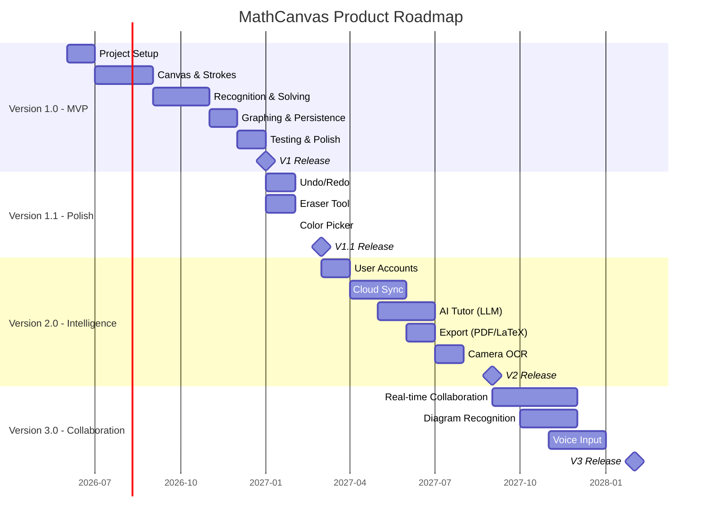

# MathCanvas — Product Requirements Document (PRD)

**Version:** 1.0
**Status:** Approved
**Last Updated:** 2026-06-12
**Owner:** Product Management
**Audience:** AI Coding Agents, Engineering, QA, Design

---

## 1. Executive Summary

MathCanvas is a mobile-first application that transforms the way users interact with mathematics. By combining an infinite digital canvas with natural handwriting input, real-time equation recognition, symbolic solving, and interactive graphing, MathCanvas unifies the fragmented workflow of note-taking, calculating, and graphing into a single, seamless experience.

Version 1 (MVP) targets Android and iOS platforms, operates entirely offline, requires no user accounts, and stores all data locally on the device. The application is built with Flutter for the frontend and FastAPI (Python) for the mathematics and graphing backend, communicating over a local REST API.

MathCanvas is designed for students, teachers, engineers, researchers, and mathematics enthusiasts who want a natural, pen-and-paper-like experience enhanced by computational power.

---

## 2. Product Vision

**Vision Statement:**
Make mathematical thinking as natural as writing on paper, with the intelligence of a computer working silently alongside.

**Long-Term Vision:**
MathCanvas will evolve into a comprehensive mathematical workspace supporting AI tutoring, collaborative work, cloud synchronization, and advanced mathematical domains — while always preserving the core principle of natural, distraction-free mathematical interaction.

---

## 3. Product Goals

### 3.1 Primary Goal

Enable users to perform mathematical work naturally — writing, solving, and graphing — without switching between note-taking apps, graphing tools, calculators, and equation solvers.

### 3.2 Secondary Goals

| ID | Goal | Priority | Measurement |
|----|------|----------|-------------|
| G-01 | Fast writing experience | High | Stroke rendering latency < 16ms (60fps) |
| G-02 | Low latency interaction | High | Recognition response < 500ms |
| G-03 | Beautiful graph visualizations | High | Interactive, zoomable, pannable graphs |
| G-04 | Offline-first architecture | Critical | 100% feature availability without network |
| G-05 | Long-term maintainability | Medium | Modular architecture, documented decisions |
| G-06 | Modular architecture | Medium | Independent, replaceable components |
| G-07 | AI-agent-friendly codebase | Medium | Comprehensive documentation, clear contracts |

---

## 4. Problem Statement

### 4.1 Current Pain Points

Mathematical work today requires users to juggle multiple disconnected tools:

1. **Paper notebooks** — Natural writing but no computation.
2. **Calculator apps** — Computation but no context or history.
3. **Graphing tools** (Desmos, GeoGebra) — Graphs but require typed equation input.
4. **CAS systems** (Wolfram Alpha, MATLAB) — Powerful but steep learning curves and require typed input.
5. **Note-taking apps** (OneNote, Notability) — Digital writing but no mathematical intelligence.

### 4.2 Core Problem

No single application allows users to **write mathematics naturally** and have the device **understand, solve, and visualize** the mathematics in real time, all while working **entirely offline**.

### 4.3 Opportunity

The intersection of improved handwriting recognition, accessible computational algebra systems, and powerful mobile hardware creates an opportunity to deliver a unified mathematical workspace that feels as natural as paper but thinks like a computer.

---

## 5. User Personas

### 5.1 Persona: University Student — "Alex"

| Attribute | Detail |
|-----------|--------|
| Age | 19 |
| Role | Undergraduate Engineering Student |
| Tech Comfort | High |
| Devices | Android phone, Android tablet with stylus |
| Pain Points | Switching between notebook, calculator, and Desmos during problem sets |
| Goals | Solve homework problems quickly, review work, visualize functions |
| Usage Pattern | Daily, 30–90 minutes per session |
| Key Features | Handwriting input, equation solving, graph generation |

### 5.2 Persona: High School Teacher — "Maria"

| Attribute | Detail |
|-----------|--------|
| Age | 35 |
| Role | Mathematics Teacher |
| Tech Comfort | Medium |
| Devices | iPad with Apple Pencil |
| Pain Points | Preparing visual explanations, demonstrating step-by-step solutions |
| Goals | Create clear mathematical explanations with graphs for students |
| Usage Pattern | Weekly, during class preparation and in-class demonstrations |
| Key Features | Real-time calculation updates, graph generation, notebook management |

### 5.3 Persona: Research Engineer — "Raj"

| Attribute | Detail |
|-----------|--------|
| Age | 28 |
| Role | Mechanical Engineer |
| Tech Comfort | Very High |
| Devices | Android tablet with stylus |
| Pain Points | Quick calculations during design reviews without opening MATLAB |
| Goals | Rapid symbolic calculation, function visualization, persistent notes |
| Usage Pattern | Several times per week, 15–45 minutes per session |
| Key Features | Symbolic solving, trigonometric graphs, notebook organization |

### 5.4 Persona: Mathematics Enthusiast — "Priya"

| Attribute | Detail |
|-----------|--------|
| Age | 16 |
| Role | High School Student, Math Competition Participant |
| Tech Comfort | Medium-High |
| Devices | Android phone (no stylus) |
| Pain Points | No affordable tool that combines writing and solving on mobile |
| Goals | Practice problems, verify solutions, explore functions visually |
| Usage Pattern | Daily, 20–60 minutes |
| Key Features | Finger input, equation solving, graph interaction |

---

## 6. User Stories

### 6.1 Canvas Interaction

| ID | Story | Priority | Acceptance Criteria |
|----|-------|----------|-------------------|
| US-C01 | As a user, I want to write on an infinite canvas so I never run out of space. | Critical | Canvas extends in all directions without boundaries. |
| US-C02 | As a user, I want to pan the canvas so I can navigate to different areas. | Critical | Two-finger pan moves canvas smoothly at 60fps. |
| US-C03 | As a user, I want to zoom in and out so I can see detail or overview. | Critical | Pinch-to-zoom works smoothly from 10% to 1000%. |
| US-C04 | As a user, I want my strokes to appear immediately as I write so it feels natural. | Critical | Stroke rendering latency < 16ms. |

### 6.2 Input

| ID | Story | Priority | Acceptance Criteria |
|----|-------|----------|-------------------|
| US-I01 | As a user, I want to write with my finger so I can use the app on any device. | Critical | Finger strokes are captured and rendered correctly. |
| US-I02 | As a user, I want to write with a stylus for precision. | Critical | Stylus input captures position and pressure. |
| US-I03 | As a user, I want pressure sensitivity so my strokes look natural. | High | Stroke width varies with pressure where hardware supports it. |
| US-I04 | As a user, I want palm rejection so I can rest my hand while writing with a stylus. | High | Palm touches are ignored when stylus is active and supported. |

### 6.3 Recognition

| ID | Story | Priority | Acceptance Criteria |
|----|-------|----------|-------------------|
| US-R01 | As a user, I want my handwritten math to be recognized so the app understands what I wrote. | Critical | Numbers, variables, operators, fractions, exponents, parentheses are recognized. |
| US-R02 | As a user, I want recognition to happen automatically so I don't have to press a button. | High | Recognition triggers after a configurable idle period (default 1.5s). |
| US-R03 | As a user, I want to see the recognized expression so I can verify accuracy. | High | Recognized LaTeX or text representation is displayed near the handwriting. |

### 6.4 Solving

| ID | Story | Priority | Acceptance Criteria |
|----|-------|----------|-------------------|
| US-S01 | As a user, I want arithmetic expressions to be evaluated automatically. | Critical | `2 + 3 * 4` → `14` is displayed. |
| US-S02 | As a user, I want algebraic equations to be solved for unknowns. | Critical | `2x + 4 = 8` → `x = 2` is displayed. |
| US-S03 | As a user, I want symbolic expressions to be simplified. | High | `x² + 2x + 1` → `(x + 1)²` is displayed. |

### 6.5 Graphing

| ID | Story | Priority | Acceptance Criteria |
|----|-------|----------|-------------------|
| US-G01 | As a user, I want to see a graph of functions I write so I can visualize them. | Critical | Writing `y = x²` produces a parabola graph. |
| US-G02 | As a user, I want to interact with the graph (pan, zoom) so I can explore it. | High | Graph supports pinch-to-zoom and drag-to-pan. |
| US-G03 | As a user, I want graphs to update when I change the equation so I see changes in real time. | High | Modifying a graphed equation updates the graph within 1 second. |

### 6.6 Real-Time Updates

| ID | Story | Priority | Acceptance Criteria |
|----|-------|----------|-------------------|
| US-RT01 | As a user, I want dependent calculations to update when I change a value. | High | Changing `a = 5` to `a = 10` when `c = a + b` exists updates `c` automatically. |
| US-RT02 | As a user, I want to see which values are linked so I understand dependencies. | Medium | Visual indicator shows dependency relationships. |

### 6.7 Notebook Management

| ID | Story | Priority | Acceptance Criteria |
|----|-------|----------|-------------------|
| US-N01 | As a user, I want to create a new notebook so I can organize my work. | Critical | Tapping "New Notebook" creates a fresh canvas. |
| US-N02 | As a user, I want to rename a notebook so I can find it later. | High | Long-press or menu allows renaming. |
| US-N03 | As a user, I want to delete a notebook I no longer need. | High | Delete with confirmation dialog. |
| US-N04 | As a user, I want to open a previously saved notebook so I can continue work. | Critical | Notebooks list shows all saved notebooks; tapping opens one. |
| US-N05 | As a user, I want my work to save automatically so I never lose progress. | Critical | Auto-save triggers every 30 seconds and on app background. |

### 6.8 Offline

| ID | Story | Priority | Acceptance Criteria |
|----|-------|----------|-------------------|
| US-O01 | As a user, I want all features to work without internet so I can use the app anywhere. | Critical | Every feature functions identically offline and online. |

---

## 7. Functional Requirements

### 7.1 Canvas Engine (FR-CE)

| ID | Requirement | Details |
|----|-------------|---------|
| FR-CE-01 | Infinite canvas | Canvas must support panning in all four directions without boundaries. |
| FR-CE-02 | Zoom | Canvas must support zoom levels from 10% to 1000% with smooth interpolation. |
| FR-CE-03 | Pan | Two-finger gesture pans the canvas view. |
| FR-CE-04 | Coordinate system | Canvas uses a world-coordinate system; screen coordinates are derived via transformation matrix. |
| FR-CE-05 | Viewport management | Only strokes within or near the viewport are rendered. |
| FR-CE-06 | Render performance | Canvas must maintain 60fps during active drawing. |

### 7.2 Stroke Capture (FR-SC)

| ID | Requirement | Details |
|----|-------------|---------|
| FR-SC-01 | Point capture | Each touch/stylus point must capture: x, y, timestamp, pressure. |
| FR-SC-02 | Stroke assembly | Points between pointer-down and pointer-up constitute a single stroke. |
| FR-SC-03 | Stroke metadata | Each stroke stores: id, notebookId, points[], color, width, createdAt. |
| FR-SC-04 | Finger input | Finger touch generates strokes. |
| FR-SC-05 | Stylus input | Stylus generates strokes with pressure data. |
| FR-SC-06 | Palm rejection | When stylus is detected, non-stylus touches are ignored. |
| FR-SC-07 | Stroke persistence | All strokes are saved to local SQLite database. |

### 7.3 Handwriting Recognition (FR-HR)

| ID | Requirement | Details |
|----|-------------|---------|
| FR-HR-01 | Recognition scope | Must recognize: digits (0-9), variables (a-z, A-Z), operators (+, -, ×, ÷, =), fractions (horizontal bar), exponents (superscript), parentheses, decimal points. |
| FR-HR-02 | Trigger | Recognition triggers after configurable idle period (default 1500ms after last stroke). |
| FR-HR-03 | Grouping | Spatially proximate strokes are grouped into expression clusters for recognition. |
| FR-HR-04 | Output | Recognition produces a structured expression string (e.g., LaTeX or custom AST). |
| FR-HR-05 | Modularity | Recognition engine must be behind an abstract interface for future replacement. |
| FR-HR-06 | Confidence | Recognition returns a confidence score (0.0–1.0). |

### 7.4 Expression Parsing (FR-EP)

| ID | Requirement | Details |
|----|-------------|---------|
| FR-EP-01 | Input | Accepts recognized expression string. |
| FR-EP-02 | Output | Produces a structured mathematical expression (AST or SymPy-compatible string). |
| FR-EP-03 | Supported forms | Must parse: arithmetic, algebraic equations, function definitions, polynomial expressions, trigonometric functions. |
| FR-EP-04 | Error handling | Malformed expressions return a structured error with position information. |

### 7.5 Math Engine (FR-ME)

| ID | Requirement | Details |
|----|-------------|---------|
| FR-ME-01 | Arithmetic evaluation | Evaluate numeric expressions and return results. |
| FR-ME-02 | Algebraic solving | Solve equations for specified variables. |
| FR-ME-03 | Symbolic simplification | Simplify symbolic expressions. |
| FR-ME-04 | Engine | Must use SymPy. |
| FR-ME-05 | API | Exposed via FastAPI REST endpoint on local device. |
| FR-ME-06 | Response format | JSON with fields: `result`, `type`, `latex`, `error`. |

### 7.6 Graph Engine (FR-GE)

| ID | Requirement | Details |
|----|-------------|---------|
| FR-GE-01 | Supported graphs | Linear, quadratic, polynomial, trigonometric functions. |
| FR-GE-02 | Graph format | Graphs generated as interactive HTML (Plotly) or as image (PNG) with computed plot data. |
| FR-GE-03 | Interactivity | Graphs support zoom, pan, and value inspection. |
| FR-GE-04 | Update | Changing the source expression regenerates the graph. |
| FR-GE-05 | Engine | Must use Plotly. |
| FR-GE-06 | API | Exposed via FastAPI REST endpoint on local device. |

### 7.7 Real-Time Updates (FR-RU)

| ID | Requirement | Details |
|----|-------------|---------|
| FR-RU-01 | Variable binding | Recognized variable assignments (e.g., `a = 5`) are stored in a session symbol table. |
| FR-RU-02 | Dependency tracking | Expressions referencing variables are tracked as dependents. |
| FR-RU-03 | Propagation | Changing a variable value triggers re-evaluation of all dependent expressions. |
| FR-RU-04 | Display update | Updated results are displayed within 1 second of the triggering change. |

### 7.8 Notebook Management (FR-NM)

| ID | Requirement | Details |
|----|-------------|---------|
| FR-NM-01 | Create notebook | Creates a new notebook with a default name ("Untitled Notebook") and empty canvas. |
| FR-NM-02 | Rename notebook | Allows renaming via inline edit or dialog. Maximum 100 characters. |
| FR-NM-03 | Delete notebook | Deletes notebook and all associated strokes, expressions, and results after confirmation. |
| FR-NM-04 | Open notebook | Loads all strokes and state for the selected notebook. |
| FR-NM-05 | Auto-save | Saves current state every 30 seconds and on app lifecycle events (background, pause). |
| FR-NM-06 | Notebook list | Displays all notebooks sorted by last modified date (newest first). |

### 7.9 Local Storage (FR-LS)

| ID | Requirement | Details |
|----|-------------|---------|
| FR-LS-01 | Database | SQLite via sqflite package. |
| FR-LS-02 | Offline | All data operations must function without network. |
| FR-LS-03 | No cloud | No cloud storage, sync, or remote backup in V1. |
| FR-LS-04 | No auth | No user accounts or authentication in V1. |
| FR-LS-05 | Migration | Database schema must support forward migrations. |

---

## 8. Non-Functional Requirements

| ID | Category | Requirement | Target |
|----|----------|-------------|--------|
| NFR-01 | Performance | Stroke rendering latency | < 16ms (60fps) |
| NFR-02 | Performance | Recognition latency | < 500ms per expression cluster |
| NFR-03 | Performance | Math solving latency | < 2s for supported operations |
| NFR-04 | Performance | Graph generation latency | < 3s for supported functions |
| NFR-05 | Performance | App cold start time | < 3s |
| NFR-06 | Performance | Canvas pan/zoom frame rate | ≥ 60fps |
| NFR-07 | Reliability | Auto-save interval | Every 30 seconds |
| NFR-08 | Reliability | Data loss on crash | ≤ 30 seconds of work lost |
| NFR-09 | Reliability | App crash rate | < 0.1% of sessions |
| NFR-10 | Capacity | Strokes per notebook | ≥ 10,000 |
| NFR-11 | Capacity | Notebooks per device | ≥ 500 |
| NFR-12 | Capacity | Points per stroke | ≥ 5,000 |
| NFR-13 | Storage | Database size per notebook (10K strokes) | < 50MB |
| NFR-14 | Compatibility | Android | API 24+ (Android 7.0+) |
| NFR-15 | Compatibility | iOS | iOS 14+ |
| NFR-16 | Accessibility | Touch target size | ≥ 44×44pt |
| NFR-17 | Accessibility | Color contrast | WCAG 2.1 AA minimum |
| NFR-18 | Accessibility | Screen reader | Basic support for navigation elements |

---

## 9. MVP Scope

### 9.1 In Scope (Version 1)

| Feature Area | Included |
|-------------|----------|
| Infinite Canvas | Pan, zoom, world-coordinate drawing |
| Touch/Stylus Input | Finger and stylus stroke capture, pressure sensitivity, palm rejection |
| Stroke Persistence | All strokes saved to SQLite |
| Handwriting Recognition | Numbers, variables, operators, fractions, exponents, parentheses |
| Equation Parsing | Arithmetic, algebra, trigonometric functions, polynomials |
| Equation Solving | Arithmetic evaluation, algebraic solving, symbolic simplification (SymPy) |
| Graph Generation | Linear, quadratic, polynomial, trigonometric (Plotly) |
| Real-Time Updates | Variable binding, dependency tracking, propagation |
| Notebook Management | Create, rename, delete, open, auto-save |
| Offline Storage | SQLite, no cloud, no auth |
| Dark Mode | Full dark mode support |

### 9.2 Out of Scope (Future Versions)

| Feature | Target Version | Notes |
|---------|---------------|-------|
| AI Tutor | V2 | LLM-powered step-by-step explanations |
| Camera OCR | V2 | Photograph handwritten math for recognition |
| Diagram Recognition | V3 | Recognize geometric shapes and diagrams |
| Collaboration | V3 | Real-time multi-user editing |
| User Accounts | V2 | Registration, login, profiles |
| Cloud Sync | V2 | Cross-device synchronization |
| Voice Input | V3 | Speak equations for input |
| LLM Integration | V2 | Natural language math queries |
| Social Features | V4 | Share notebooks, community |
| Payments | V4 | Premium features |
| Marketplace | V4+ | Template marketplace |
| Export (PDF/LaTeX) | V2 | Export notebooks to standard formats |
| Undo/Redo | V1.1 | Stroke-level undo/redo stack |
| Eraser Tool | V1.1 | Stroke and area eraser |
| Color Picker | V1.1 | Custom stroke colors |
| Matrix Operations | V2 | Matrix input and linear algebra |

---

## 10. Risks

| ID | Risk | Probability | Impact | Mitigation |
|----|------|------------|--------|------------|
| R-01 | Handwriting recognition accuracy is too low for usable experience | Medium | Critical | Use modular recognition interface; start with well-scoped symbol set; provide manual correction mechanism in V1.1 |
| R-02 | Local SymPy execution is too slow on mobile devices | Medium | High | Run SymPy in embedded Python (FastAPI local server); cache results; set timeout limits |
| R-03 | Canvas performance degrades with many strokes | Medium | High | Implement viewport culling; use spatial indexing; batch render operations |
| R-04 | Plotly graphs are too large or slow to render on mobile | Low | Medium | Generate pre-rendered images as fallback; limit graph complexity |
| R-05 | Embedding Python runtime on mobile is complex | High | Critical | Use Chaquopy (Android) or equivalent; document build pipeline thoroughly |
| R-06 | Palm rejection is unreliable across devices | Medium | Medium | Implement configurable sensitivity; allow manual toggle |
| R-07 | SQLite performance degrades with large datasets | Low | Medium | Implement pagination; use indexes; monitor query performance |
| R-08 | Stroke grouping heuristics produce incorrect expression boundaries | Medium | High | Tune spatial clustering parameters; allow manual grouping in V1.1 |

---

## 11. Assumptions

| ID | Assumption | Impact if Wrong |
|----|-----------|----------------|
| A-01 | Users will primarily use a stylus on tablets for mathematical writing. | Finger input on phones may need UX optimization. |
| A-02 | A local FastAPI server can run on both Android and iOS within acceptable resource constraints. | Alternative computation strategies would be needed (e.g., compiled math library). |
| A-03 | SymPy can handle all V1 mathematical operations within 2 seconds on mobile hardware. | May need to limit operation complexity or use alternative solver. |
| A-04 | Users write one expression at a time (not concurrent multi-area writing). | Recognition pipeline is designed for sequential processing. |
| A-05 | Plotly can generate interactive graphs suitable for mobile WebView rendering. | May need to switch to a native Flutter charting library. |
| A-06 | The handwriting recognition model can be bundled within the app binary. | Large models may require download-on-first-use. |
| A-07 | SQLite is sufficient for all V1 storage needs. | Would need to evaluate alternatives for complex querying. |
| A-08 | Users accept a brief delay (< 500ms) between writing and recognition. | Real-time character-by-character recognition would require different architecture. |

---

## 12. Success Metrics

### 12.1 Quantitative Metrics

| Metric | Target | Measurement Method |
|--------|--------|-------------------|
| Recognition accuracy | ≥ 85% for supported symbols | Automated test suite against reference dataset |
| Stroke rendering frame rate | ≥ 60fps | Performance profiling on reference devices |
| App crash rate | < 0.1% of sessions | Crash reporting framework |
| Auto-save reliability | 100% (no data loss on normal exit) | Integration tests |
| Cold start time | < 3 seconds | Automated timing tests |
| Solve latency (arithmetic) | < 500ms | API response time logging |
| Solve latency (algebra) | < 2s | API response time logging |
| Graph generation latency | < 3s | API response time logging |

### 12.2 Qualitative Metrics

| Metric | Target | Measurement Method |
|--------|--------|-------------------|
| Writing naturalness | "Feels like paper" | User testing feedback |
| Feature discoverability | Users find solve/graph without tutorial | Usability testing |
| Overall satisfaction | ≥ 4.0/5.0 | Beta tester surveys |

---

## 13. KPIs

| KPI | Definition | V1 Target | Measurement Period |
|-----|-----------|-----------|-------------------|
| Daily Active Notebooks | Number of notebooks opened per day per user | ≥ 1.5 | Weekly |
| Session Duration | Average time spent in canvas per session | ≥ 10 minutes | Weekly |
| Expressions Recognized | Average recognized expressions per session | ≥ 5 | Weekly |
| Graphs Generated | Average graphs generated per session | ≥ 1 | Weekly |
| Retention (D7) | Percentage of users returning after 7 days | ≥ 30% | Monthly |
| Retention (D30) | Percentage of users returning after 30 days | ≥ 15% | Monthly |

---

## 14. Competitive Analysis

| Product | Platform | Handwriting | Recognition | Solving | Graphing | Offline | Free |
|---------|----------|-------------|-------------|---------|----------|---------|------|
| **Apple Math Notes** | iOS/iPadOS only | ✅ Excellent | ✅ Excellent | ✅ Good | ✅ Good | ✅ Yes | ✅ Yes |
| **Nebo** | iOS, Android, Windows | ✅ Excellent | ✅ Excellent | ❌ No | ❌ No | ✅ Yes | ❌ Paid |
| **MyScript Calculator** | iOS, Android | ✅ Good | ✅ Good | ✅ Arithmetic only | ❌ No | ✅ Yes | ✅ Free |
| **Desmos** | Web, iOS, Android | ❌ No | N/A | ❌ No | ✅ Excellent | ❌ No | ✅ Yes |
| **GeoGebra** | Web, iOS, Android | ❌ No | N/A | ✅ Good | ✅ Excellent | Partial | ✅ Yes |
| **Wolfram Alpha** | Web, iOS, Android | ❌ No | N/A | ✅ Excellent | ✅ Good | ❌ No | Freemium |
| **MathCanvas (V1)** | iOS, Android | ✅ Good | ✅ Good | ✅ Good | ✅ Good | ✅ Yes | ✅ Yes |

### 14.1 Competitive Advantages

1. **Cross-platform** — Works on both Android and iOS (unlike Apple Math Notes).
2. **Full pipeline** — Handwriting → Recognition → Solving → Graphing in one app.
3. **Offline-first** — Complete functionality without internet.
4. **Free** — No payment required for V1.
5. **Open architecture** — Modular, extensible design.

### 14.2 Competitive Disadvantages (V1)

1. **Recognition quality** — Unlikely to match Apple or MyScript quality initially.
2. **No undo/redo** — Significant UX gap (planned for V1.1).
3. **No export** — Cannot export to PDF/LaTeX (planned for V2).
4. **Python dependency** — Embedded Python runtime adds complexity and app size.

---

## 15. Product Roadmap

### 15.1 Version Timeline

### 15.2 Version Details

| Version | Theme | Key Features | Estimated Release |
|---------|-------|-------------|-------------------|
| **V1.0** | MVP — Write, Solve, Graph | Infinite canvas, handwriting, recognition, solving, graphing, notebooks, offline | Q1 2027 |
| **V1.1** | Polish — Editing Tools | Undo/redo, eraser, color picker, stroke selection | Q1 2027 |
| **V2.0** | Intelligence — AI & Cloud | User accounts, cloud sync, AI tutor, export, camera OCR | Q3 2027 |
| **V3.0** | Collaboration — Social | Real-time collaboration, diagram recognition, voice input | Q1 2028 |
| **V4.0** | Platform — Ecosystem | Social features, payments, template marketplace | Q3 2028 |

---

## 16. Document References

| Document | Purpose |
|----------|---------|
| [TRD.md](file:///d:/MathCanvas/TRD.md) | Technical architecture and design decisions |
| [AppFlow.md](file:///d:/MathCanvas/AppFlow.md) | Navigation, user journeys, and interaction flows |
| [Schema.md](file:///d:/MathCanvas/Schema.md) | Database schema and data model |
| [ImplementationPlan.md](file:///d:/MathCanvas/ImplementationPlan.md) | Phased development plan |
| [Tracker.md](file:///d:/MathCanvas/Tracker.md) | Project tracking for AI agents |
| [Rules.md](file:///d:/MathCanvas/Rules.md) | Coding standards and agent rules |
| [UI_UX.md](file:///d:/MathCanvas/UI_UX.md) | Design system and UX specifications |
| [Structure.md](file:///d:/MathCanvas/Structure.md) | Repository structure and governance |

---

*End of PRD.md*
