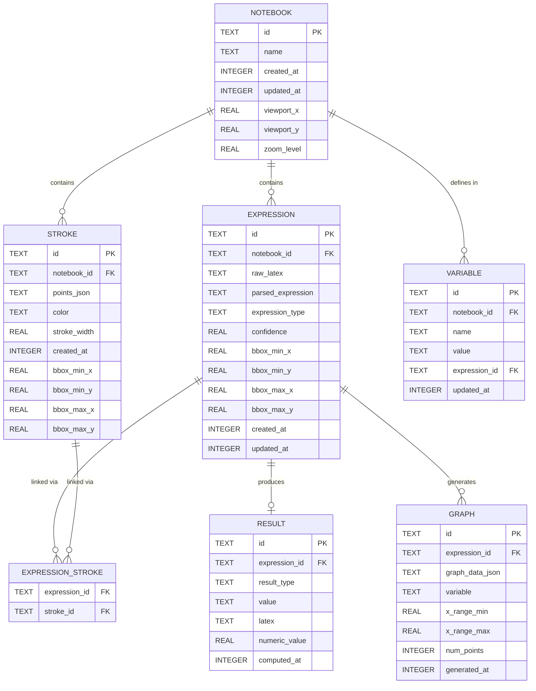

# MathCanvas — Database Schema Document

**Version:** 1.0
**Status:** Approved
**Last Updated:** 2026-06-12
**Owner:** Database Architecture
**Audience:** AI Coding Agents, Engineering
**References:** [PRD.md](file:///d:/MathCanvas/PRD.md), [TRD.md](file:///d:/MathCanvas/TRD.md), [Structure.md](file:///d:/MathCanvas/Structure.md)

---

## 1. Entity Definitions

### 1.1 Entity Overview



### 1.2 Entity Descriptions

| Entity | Purpose | Lifecycle |
|--------|---------|-----------|
| **Notebook** | Top-level container for a user's mathematical workspace | Created by user, persists until deleted |
| **Stroke** | A single continuous line drawn by the user (finger or stylus) | Created on pointer-up, persists with notebook |
| **Expression** | A recognized mathematical expression composed of grouped strokes | Created by recognition engine, updated on re-recognition |
| **Result** | The computed output (solution, evaluation, simplification) of an expression | Created by math engine, updated when expression changes |
| **Expression_Stroke** | Junction table linking strokes to their recognized expression | Created during recognition grouping |
| **Graph** | Generated graph data for a function expression | Created by graph engine, regenerated on expression change |
| **Variable** | A named variable assignment within a notebook's symbol table | Created on assignment recognition, updated on value change |

---

## 2. SQLite Schema

### 2.1 Database Configuration

```sql
-- Database: mathcanvas.db
-- Encoding: UTF-8
-- Journal Mode: WAL
-- Foreign Keys: ON

PRAGMA journal_mode = WAL;
PRAGMA foreign_keys = ON;
PRAGMA synchronous = NORMAL;
PRAGMA cache_size = 2000;
PRAGMA temp_store = MEMORY;
```

### 2.2 Schema Version Table

```sql
CREATE TABLE IF NOT EXISTS schema_version (
    version     INTEGER NOT NULL,
    applied_at  INTEGER NOT NULL DEFAULT (strftime('%s', 'now')),
    description TEXT
);

-- Initial schema version
INSERT INTO schema_version (version, description) VALUES (1, 'Initial schema');
```

### 2.3 Notebooks Table

```sql
CREATE TABLE IF NOT EXISTS notebooks (
    id          TEXT PRIMARY KEY NOT NULL,       -- UUID v4
    name        TEXT NOT NULL DEFAULT 'Untitled Notebook',
    created_at  INTEGER NOT NULL,               -- Unix timestamp (milliseconds)
    updated_at  INTEGER NOT NULL,               -- Unix timestamp (milliseconds)
    viewport_x  REAL NOT NULL DEFAULT 0.0,      -- Last viewport X offset
    viewport_y  REAL NOT NULL DEFAULT 0.0,      -- Last viewport Y offset
    zoom_level  REAL NOT NULL DEFAULT 1.0       -- Last zoom level
);

-- Index for listing notebooks sorted by recency
CREATE INDEX IF NOT EXISTS idx_notebooks_updated_at ON notebooks(updated_at DESC);
```

**Column Specifications:**

| Column | Type | Nullable | Default | Constraints | Description |
|--------|------|----------|---------|-------------|-------------|
| id | TEXT | No | — | PRIMARY KEY | UUID v4 string |
| name | TEXT | No | 'Untitled Notebook' | MAX 100 chars (app-enforced) | User-visible notebook name |
| created_at | INTEGER | No | — | > 0 | Creation time as Unix ms |
| updated_at | INTEGER | No | — | ≥ created_at | Last modification time as Unix ms |
| viewport_x | REAL | No | 0.0 | — | Viewport X when notebook was last closed |
| viewport_y | REAL | No | 0.0 | — | Viewport Y when notebook was last closed |
| zoom_level | REAL | No | 1.0 | 0.1 ≤ zoom ≤ 10.0 (app-enforced) | Zoom level when notebook was last closed |

### 2.4 Strokes Table

```sql
CREATE TABLE IF NOT EXISTS strokes (
    id            TEXT PRIMARY KEY NOT NULL,     -- UUID v4
    notebook_id   TEXT NOT NULL,                 -- FK to notebooks.id
    points_json   TEXT NOT NULL,                 -- JSON array of point objects
    color         TEXT NOT NULL DEFAULT '#000000', -- Hex color string
    stroke_width  REAL NOT NULL DEFAULT 2.0,     -- Stroke width in logical pixels
    created_at    INTEGER NOT NULL,              -- Unix timestamp (milliseconds)
    bbox_min_x    REAL NOT NULL,                 -- Bounding box min X (world coords)
    bbox_min_y    REAL NOT NULL,                 -- Bounding box min Y (world coords)
    bbox_max_x    REAL NOT NULL,                 -- Bounding box max X (world coords)
    bbox_max_y    REAL NOT NULL,                 -- Bounding box max Y (world coords)

    FOREIGN KEY (notebook_id) REFERENCES notebooks(id) ON DELETE CASCADE
);

-- Index for loading strokes by notebook
CREATE INDEX IF NOT EXISTS idx_strokes_notebook_id ON strokes(notebook_id);

-- Index for spatial queries (viewport culling)
CREATE INDEX IF NOT EXISTS idx_strokes_bbox ON strokes(notebook_id, bbox_min_x, bbox_min_y, bbox_max_x, bbox_max_y);

-- Index for ordered loading
CREATE INDEX IF NOT EXISTS idx_strokes_created_at ON strokes(notebook_id, created_at);
```

**Column Specifications:**

| Column | Type | Nullable | Default | Description |
|--------|------|----------|---------|-------------|
| id | TEXT | No | — | UUID v4 string |
| notebook_id | TEXT | No | — | Parent notebook reference |
| points_json | TEXT | No | — | JSON array of `StrokePoint` objects |
| color | TEXT | No | '#000000' | Hex color string (6-digit with #) |
| stroke_width | REAL | No | 2.0 | Base stroke width in logical pixels |
| created_at | INTEGER | No | — | Creation time as Unix ms |
| bbox_min_x | REAL | No | — | Bounding box left edge (world coords) |
| bbox_min_y | REAL | No | — | Bounding box top edge (world coords) |
| bbox_max_x | REAL | No | — | Bounding box right edge (world coords) |
| bbox_max_y | REAL | No | — | Bounding box bottom edge (world coords) |

**points_json Format:**

```json
[
  {"x": 150.0, "y": 200.5, "t": 1718193600000, "p": 0.75},
  {"x": 151.2, "y": 201.0, "t": 1718193600008, "p": 0.80},
  {"x": 152.5, "y": 201.3, "t": 1718193600016, "p": 0.78}
]
```

| Field | Type | Description |
|-------|------|-------------|
| x | float | X coordinate in world space |
| y | float | Y coordinate in world space |
| t | int | Timestamp in Unix milliseconds |
| p | float | Pressure (0.0 to 1.0, default 1.0 if unavailable) |

### 2.5 Expressions Table

```sql
CREATE TABLE IF NOT EXISTS expressions (
    id                TEXT PRIMARY KEY NOT NULL,   -- UUID v4
    notebook_id       TEXT NOT NULL,               -- FK to notebooks.id
    raw_latex         TEXT NOT NULL,               -- Raw LaTeX from recognition
    parsed_expression TEXT,                        -- SymPy-compatible string (after parsing)
    expression_type   TEXT NOT NULL DEFAULT 'unknown', -- See expression_type enum
    confidence        REAL NOT NULL DEFAULT 0.0,   -- Recognition confidence (0.0-1.0)
    bbox_min_x        REAL NOT NULL,               -- Expression bounding box
    bbox_min_y        REAL NOT NULL,
    bbox_max_x        REAL NOT NULL,
    bbox_max_y        REAL NOT NULL,
    created_at        INTEGER NOT NULL,            -- Unix timestamp (milliseconds)
    updated_at        INTEGER NOT NULL,            -- Unix timestamp (milliseconds)

    FOREIGN KEY (notebook_id) REFERENCES notebooks(id) ON DELETE CASCADE
);

CREATE INDEX IF NOT EXISTS idx_expressions_notebook_id ON expressions(notebook_id);
CREATE INDEX IF NOT EXISTS idx_expressions_type ON expressions(notebook_id, expression_type);
```

**expression_type Values:**

| Value | Description | Example |
|-------|-------------|---------|
| `arithmetic` | Numeric expression to evaluate | `2 + 3 * 4` |
| `equation` | Equation to solve for unknowns | `2*x + 4 = 8` |
| `function` | Function definition (graphable) | `y = x**2` |
| `assignment` | Variable assignment | `a = 5` |
| `expression` | Symbolic expression to simplify | `x**2 + 2*x + 1` |
| `unknown` | Not yet classified | (default) |

### 2.6 Results Table

```sql
CREATE TABLE IF NOT EXISTS results (
    id             TEXT PRIMARY KEY NOT NULL,     -- UUID v4
    expression_id  TEXT NOT NULL UNIQUE,          -- FK to expressions.id (1:1)
    result_type    TEXT NOT NULL,                 -- See result_type enum
    value          TEXT NOT NULL,                 -- String representation of result
    latex          TEXT NOT NULL,                 -- LaTeX representation of result
    numeric_value  REAL,                          -- Numeric value (NULL for symbolic)
    computed_at    INTEGER NOT NULL,              -- Unix timestamp (milliseconds)

    FOREIGN KEY (expression_id) REFERENCES expressions(id) ON DELETE CASCADE
);

CREATE INDEX IF NOT EXISTS idx_results_expression_id ON results(expression_id);
```

**result_type Values:**

| Value | Description | Example |
|-------|-------------|---------|
| `numeric` | Numeric evaluation result | `14` |
| `solution` | Algebraic solution | `x = 2` |
| `simplified` | Simplified expression | `(x + 1)^2` |
| `error` | Computation error | `Cannot solve` |

### 2.7 Expression_Strokes Junction Table

```sql
CREATE TABLE IF NOT EXISTS expression_strokes (
    expression_id  TEXT NOT NULL,                  -- FK to expressions.id
    stroke_id      TEXT NOT NULL,                  -- FK to strokes.id

    PRIMARY KEY (expression_id, stroke_id),
    FOREIGN KEY (expression_id) REFERENCES expressions(id) ON DELETE CASCADE,
    FOREIGN KEY (stroke_id) REFERENCES strokes(id) ON DELETE CASCADE
);

CREATE INDEX IF NOT EXISTS idx_expression_strokes_stroke ON expression_strokes(stroke_id);
```

### 2.8 Graphs Table

```sql
CREATE TABLE IF NOT EXISTS graphs (
    id              TEXT PRIMARY KEY NOT NULL,     -- UUID v4
    expression_id   TEXT NOT NULL,                 -- FK to expressions.id
    graph_data_json TEXT NOT NULL,                 -- JSON: {x: [], y: [], title, color}
    variable        TEXT NOT NULL DEFAULT 'x',     -- Independent variable
    x_range_min     REAL NOT NULL DEFAULT -10.0,   -- X axis minimum
    x_range_max     REAL NOT NULL DEFAULT 10.0,    -- X axis maximum
    num_points      INTEGER NOT NULL DEFAULT 500,  -- Number of data points
    generated_at    INTEGER NOT NULL,              -- Unix timestamp (milliseconds)

    FOREIGN KEY (expression_id) REFERENCES expressions(id) ON DELETE CASCADE
);

CREATE INDEX IF NOT EXISTS idx_graphs_expression_id ON graphs(expression_id);
```

**graph_data_json Format:**

```json
{
  "x": [-10.0, -9.96, -9.92, ...],
  "y": [96.0, 95.2, 94.4, ...],
  "x_label": "x",
  "y_label": "y",
  "title": "y = x² - 4",
  "color": "#6366f1"
}
```

### 2.9 Variables Table

```sql
CREATE TABLE IF NOT EXISTS variables (
    id             TEXT PRIMARY KEY NOT NULL,      -- UUID v4
    notebook_id    TEXT NOT NULL,                   -- FK to notebooks.id
    name           TEXT NOT NULL,                   -- Variable name (e.g., 'a', 'x1')
    value          TEXT NOT NULL,                   -- String representation of value
    expression_id  TEXT,                            -- FK to expression that defined this variable
    updated_at     INTEGER NOT NULL,               -- Unix timestamp (milliseconds)

    FOREIGN KEY (notebook_id) REFERENCES notebooks(id) ON DELETE CASCADE,
    FOREIGN KEY (expression_id) REFERENCES expressions(id) ON DELETE SET NULL,
    UNIQUE(notebook_id, name)
);

CREATE INDEX IF NOT EXISTS idx_variables_notebook_id ON variables(notebook_id);
CREATE INDEX IF NOT EXISTS idx_variables_name ON variables(notebook_id, name);
```

---

## 3. Relationships

### 3.1 Relationship Matrix

| Parent | Child | Relationship | Cascade Delete | Description |
|--------|-------|-------------|----------------|-------------|
| Notebook | Stroke | 1:N | Yes | A notebook contains many strokes |
| Notebook | Expression | 1:N | Yes | A notebook contains many recognized expressions |
| Notebook | Variable | 1:N | Yes | A notebook maintains a symbol table |
| Expression | Result | 1:1 | Yes | Each expression has at most one current result |
| Expression | Graph | 1:N | Yes | A function expression may have multiple graph snapshots |
| Expression | Expression_Stroke | 1:N | Yes | An expression is composed of multiple strokes |
| Stroke | Expression_Stroke | 1:N | Yes | A stroke may belong to an expression |
| Expression | Variable | 1:1 (optional) | SET NULL | An assignment expression defines a variable |

### 3.2 Referential Integrity

All foreign keys enforce `ON DELETE CASCADE` except:
- `variables.expression_id` → `ON DELETE SET NULL` (variable persists even if expression is re-recognized).

---

## 4. Constraints

### 4.1 Application-Level Constraints

These constraints are enforced in the Dart/Flutter data layer, not in SQL:

| Entity | Field | Constraint | Error Message |
|--------|-------|-----------|---------------|
| Notebook | name | Length: 1–100 characters | "Notebook name must be between 1 and 100 characters" |
| Notebook | name | Non-empty after trim | "Notebook name cannot be blank" |
| Notebook | zoom_level | Range: 0.1–10.0 | "Zoom level out of range" |
| Stroke | points_json | Valid JSON array with ≥ 2 points | "Invalid stroke data" |
| Stroke | color | Valid hex color (#RRGGBB) | "Invalid color format" |
| Stroke | stroke_width | Range: 0.5–20.0 | "Stroke width out of range" |
| Expression | raw_latex | Non-empty string | "Expression cannot be empty" |
| Expression | confidence | Range: 0.0–1.0 | "Invalid confidence score" |
| Variable | name | Matches `^[a-zA-Z][a-zA-Z0-9_]*$` | "Invalid variable name" |

### 4.2 Database-Level Constraints

| Constraint | Table | Type | Details |
|-----------|-------|------|---------|
| Primary keys | All | PK | UUID v4, TEXT type |
| Foreign keys | strokes, expressions, etc. | FK | CASCADE delete |
| Unique | results.expression_id | UNIQUE | One result per expression |
| Unique | variables(notebook_id, name) | UNIQUE | One variable per name per notebook |
| Composite PK | expression_strokes | PK | (expression_id, stroke_id) |
| NOT NULL | Most fields | NOT NULL | See column specs |

---

## 5. Indexes

### 5.1 Index Summary

| Index Name | Table | Columns | Purpose |
|-----------|-------|---------|---------|
| `idx_notebooks_updated_at` | notebooks | updated_at DESC | Sort notebooks by recency |
| `idx_strokes_notebook_id` | strokes | notebook_id | Load strokes for a notebook |
| `idx_strokes_bbox` | strokes | notebook_id, bbox_min_x, bbox_min_y, bbox_max_x, bbox_max_y | Spatial queries for viewport culling |
| `idx_strokes_created_at` | strokes | notebook_id, created_at | Ordered stroke loading |
| `idx_expressions_notebook_id` | expressions | notebook_id | Load expressions for a notebook |
| `idx_expressions_type` | expressions | notebook_id, expression_type | Filter expressions by type |
| `idx_results_expression_id` | results | expression_id | Look up result for expression |
| `idx_expression_strokes_stroke` | expression_strokes | stroke_id | Reverse lookup: stroke → expression |
| `idx_graphs_expression_id` | graphs | expression_id | Look up graphs for expression |
| `idx_variables_notebook_id` | variables | notebook_id | Load variables for a notebook |
| `idx_variables_name` | variables | notebook_id, name | Look up variable by name |

### 5.2 Index Strategy

- **Primary lookup pattern:** Load all data for a notebook. All child tables are indexed on `notebook_id`.
- **Spatial queries:** The `idx_strokes_bbox` index enables viewport culling without scanning all strokes.
- **Ordering:** `idx_strokes_created_at` ensures strokes render in creation order.
- **Junction table:** `idx_expression_strokes_stroke` enables reverse lookup (given a stroke, find its expression).

---

## 6. Storage Strategy

### 6.1 File Location

| Platform | Database Path |
|----------|--------------|
| Android | `Context.getDatabasesPath() + '/mathcanvas.db'` |
| iOS | `Documents directory + '/mathcanvas.db'` |

SQLite database files (`.db`, `-wal`, `-shm`) are stored in the application's private data directory. Users cannot directly access these files.

### 6.2 Storage Estimates

| Scenario | Strokes | Avg Points/Stroke | Estimated DB Size |
|----------|---------|-------------------|-------------------|
| Light notebook | 100 | 50 | ~200 KB |
| Medium notebook | 1,000 | 80 | ~3 MB |
| Heavy notebook | 5,000 | 100 | ~20 MB |
| Maximum notebook | 10,000 | 100 | ~40 MB |

**Estimation formula:**
- Each point: ~40 bytes JSON (`{"x":150.0,"y":200.5,"t":1718193600000,"p":0.75}`)
- Each stroke overhead: ~200 bytes (metadata, UUIDs, colors)
- Each stroke: 200 + (points × 40) bytes
- Each expression: ~500 bytes
- Each result: ~300 bytes
- Each graph: ~20 KB (500 data points)

### 6.3 Storage Optimization

1. **Point compression (future):** Store points in binary format instead of JSON to reduce size by ~60%.
2. **Stroke simplification (future):** Apply Douglas-Peucker on save for zoomed-out rendering.
3. **Lazy loading:** Load only viewport-visible strokes on notebook open; load rest in background.
4. **WAL mode:** Enables concurrent reads and writes with minimal locking.

---

## 7. Data Retention Strategy

### 7.1 V1 Retention Rules

| Data | Retention | Deletion Trigger |
|------|-----------|-----------------|
| Notebooks | Permanent until user deletes | User action (delete) |
| Strokes | Lifetime of parent notebook | Cascade on notebook delete |
| Expressions | Lifetime of parent notebook | Cascade on notebook delete |
| Results | Lifetime of parent expression | Cascade on expression delete/re-evaluate |
| Graphs | Lifetime of parent expression | Regenerated on expression change |
| Variables | Lifetime of parent notebook | Cascade on notebook delete |

### 7.2 Deletion Cascade Order

When a notebook is deleted:

```
1. DELETE FROM graphs WHERE expression_id IN (SELECT id FROM expressions WHERE notebook_id = ?)
2. DELETE FROM results WHERE expression_id IN (SELECT id FROM expressions WHERE notebook_id = ?)
3. DELETE FROM expression_strokes WHERE expression_id IN (SELECT id FROM expressions WHERE notebook_id = ?)
4. DELETE FROM expression_strokes WHERE stroke_id IN (SELECT id FROM strokes WHERE notebook_id = ?)
5. DELETE FROM variables WHERE notebook_id = ?
6. DELETE FROM expressions WHERE notebook_id = ?
7. DELETE FROM strokes WHERE notebook_id = ?
8. DELETE FROM notebooks WHERE id = ?
```

**Note:** Because all foreign keys use `ON DELETE CASCADE`, only step 8 is needed in practice. The database handles cascading automatically.

---

## 8. Migration Strategy

### 8.1 Migration Framework

Migrations are managed using a version-based strategy. The `schema_version` table tracks applied migrations.

```dart
class DatabaseMigrations {
  static const int currentVersion = 1;

  static final Map<int, String> migrations = {
    1: '''
      -- V1: Initial schema
      -- All CREATE TABLE statements from Section 2
    ''',
    // Future migrations:
    // 2: 'ALTER TABLE strokes ADD COLUMN is_erased INTEGER DEFAULT 0;',
    // 3: 'CREATE TABLE tags (...);',
  };

  static Future<void> migrate(Database db, int oldVersion, int newVersion) async {
    for (int version = oldVersion + 1; version <= newVersion; version++) {
      final sql = migrations[version];
      if (sql != null) {
        await db.execute(sql);
        await db.insert('schema_version', {
          'version': version,
          'applied_at': DateTime.now().millisecondsSinceEpoch,
          'description': 'Migration to version $version',
        });
      }
    }
  }
}
```

### 8.2 Migration Rules

1. **Forward-only:** Migrations only move forward. No rollback support in V1.
2. **Non-destructive:** Never drop columns or tables in migrations. Use `ADD COLUMN` and deprecation flags.
3. **Idempotent:** Use `CREATE TABLE IF NOT EXISTS` and `CREATE INDEX IF NOT EXISTS`.
4. **Tested:** Every migration must have a corresponding test that applies it to the previous schema version.
5. **Documented:** Every migration must include a description in the `schema_version` table.

### 8.3 Migration Testing

```dart
test('migration from v1 to v2 adds is_erased column', () async {
  // 1. Create database with v1 schema
  // 2. Insert sample v1 data
  // 3. Run migration to v2
  // 4. Verify new column exists with correct default
  // 5. Verify existing data is intact
});
```

---

## 9. Versioning Strategy

### 9.1 Schema Versioning

| Version | Description | Date |
|---------|-------------|------|
| 1 | Initial schema: notebooks, strokes, expressions, results, graphs, variables | 2026-06-12 |

### 9.2 Compatibility Matrix

| App Version | Min Schema Version | Max Schema Version |
|------------|-------------------|-------------------|
| 1.0.0 | 1 | 1 |

### 9.3 Future Schema Changes

Reserved schema changes for future versions:

| Future Version | Change | Impact |
|---------------|--------|--------|
| 2 | Add `is_erased` column to strokes | Supports eraser tool (V1.1) |
| 3 | Add `tags` table, `notebook_tags` junction | Notebook organization (V1.1) |
| 4 | Add `user_id` column to notebooks | User accounts (V2) |
| 5 | Add `sync_status`, `remote_id` columns | Cloud sync (V2) |
| 6 | Add `collaborator` table | Collaboration (V3) |

---

## 10. Sample Payloads

### 10.1 Create Notebook

**Insert:**
```json
{
  "id": "a1b2c3d4-5678-4e9f-a012-3456789abcde",
  "name": "Algebra Homework",
  "created_at": 1718193600000,
  "updated_at": 1718193600000,
  "viewport_x": 0.0,
  "viewport_y": 0.0,
  "zoom_level": 1.0
}
```

### 10.2 Create Stroke

**Insert:**
```json
{
  "id": "f1e2d3c4-5678-4b9a-0123-456789abcdef",
  "notebook_id": "a1b2c3d4-5678-4e9f-a012-3456789abcde",
  "points_json": "[{\"x\":150.0,\"y\":200.5,\"t\":1718193610000,\"p\":0.75},{\"x\":151.2,\"y\":201.0,\"t\":1718193610008,\"p\":0.80},{\"x\":175.8,\"y\":200.2,\"t\":1718193610200,\"p\":0.72}]",
  "color": "#000000",
  "stroke_width": 2.0,
  "created_at": 1718193610000,
  "bbox_min_x": 150.0,
  "bbox_min_y": 200.2,
  "bbox_max_x": 175.8,
  "bbox_max_y": 201.0
}
```

### 10.3 Create Expression

**Insert:**
```json
{
  "id": "b2c3d4e5-6789-4fab-0123-456789abcdef",
  "notebook_id": "a1b2c3d4-5678-4e9f-a012-3456789abcde",
  "raw_latex": "2x + 4 = 8",
  "parsed_expression": "Eq(2*x + 4, 8)",
  "expression_type": "equation",
  "confidence": 0.92,
  "bbox_min_x": 140.0,
  "bbox_min_y": 190.0,
  "bbox_max_x": 280.0,
  "bbox_max_y": 220.0,
  "created_at": 1718193612000,
  "updated_at": 1718193612000
}
```

### 10.4 Create Result

**Insert:**
```json
{
  "id": "c3d4e5f6-7890-4abc-0123-456789abcdef",
  "expression_id": "b2c3d4e5-6789-4fab-0123-456789abcdef",
  "result_type": "solution",
  "value": "x = 2",
  "latex": "x = 2",
  "numeric_value": 2.0,
  "computed_at": 1718193612500
}
```

### 10.5 Create Variable Assignment

**Flow: User writes `a = 5`**

Expression insert:
```json
{
  "id": "d4e5f6a7-8901-4bcd-0123-456789abcdef",
  "notebook_id": "a1b2c3d4-5678-4e9f-a012-3456789abcde",
  "raw_latex": "a = 5",
  "parsed_expression": "a = 5",
  "expression_type": "assignment",
  "confidence": 0.95,
  "bbox_min_x": 100.0,
  "bbox_min_y": 300.0,
  "bbox_max_x": 180.0,
  "bbox_max_y": 330.0,
  "created_at": 1718193620000,
  "updated_at": 1718193620000
}
```

Variable insert:
```json
{
  "id": "e5f6a7b8-9012-4cde-0123-456789abcdef",
  "notebook_id": "a1b2c3d4-5678-4e9f-a012-3456789abcde",
  "name": "a",
  "value": "5",
  "expression_id": "d4e5f6a7-8901-4bcd-0123-456789abcdef",
  "updated_at": 1718193620000
}
```

### 10.6 Create Graph

**Insert:**
```json
{
  "id": "f6a7b8c9-0123-4def-0123-456789abcdef",
  "expression_id": "b2c3d4e5-6789-4fab-0123-456789abcdef",
  "graph_data_json": "{\"x\":[-10,-9.96,-9.92],\"y\":[96,95.2,94.4],\"x_label\":\"x\",\"y_label\":\"y\",\"title\":\"y = x² - 4\",\"color\":\"#6366f1\"}",
  "variable": "x",
  "x_range_min": -10.0,
  "x_range_max": 10.0,
  "num_points": 500,
  "generated_at": 1718193625000
}
```

### 10.7 Common Queries

**Load notebook with all data:**
```sql
-- 1. Get notebook
SELECT * FROM notebooks WHERE id = ?;

-- 2. Get all strokes (ordered)
SELECT * FROM strokes WHERE notebook_id = ? ORDER BY created_at ASC;

-- 3. Get all expressions
SELECT * FROM expressions WHERE notebook_id = ? ORDER BY created_at ASC;

-- 4. Get all results for expressions
SELECT r.* FROM results r
  INNER JOIN expressions e ON r.expression_id = e.id
  WHERE e.notebook_id = ?;

-- 5. Get all graphs for expressions
SELECT g.* FROM graphs g
  INNER JOIN expressions e ON g.expression_id = e.id
  WHERE e.notebook_id = ?;

-- 6. Get all variables
SELECT * FROM variables WHERE notebook_id = ? ORDER BY name ASC;

-- 7. Get expression-stroke mappings
SELECT es.* FROM expression_strokes es
  INNER JOIN expressions e ON es.expression_id = e.id
  WHERE e.notebook_id = ?;
```

**Viewport culling query:**
```sql
SELECT * FROM strokes
WHERE notebook_id = ?
  AND bbox_max_x >= ?  -- viewport left
  AND bbox_min_x <= ?  -- viewport right
  AND bbox_max_y >= ?  -- viewport top
  AND bbox_min_y <= ?  -- viewport bottom
ORDER BY created_at ASC;
```

**Notebook list:**
```sql
SELECT
  n.id,
  n.name,
  n.updated_at,
  (SELECT COUNT(*) FROM strokes s WHERE s.notebook_id = n.id) as stroke_count
FROM notebooks n
ORDER BY n.updated_at DESC;
```

---

## 11. Data Access Objects (DAOs)

### 11.1 DAO Interface Pattern

Each table has a corresponding DAO class:

```dart
abstract class NotebookDao {
  Future<void> insert(NotebookEntity notebook);
  Future<void> update(NotebookEntity notebook);
  Future<void> delete(String id);
  Future<NotebookEntity?> getById(String id);
  Future<List<NotebookEntity>> getAll();
}

abstract class StrokeDao {
  Future<void> insert(StrokeEntity stroke);
  Future<void> insertBatch(List<StrokeEntity> strokes);
  Future<void> delete(String id);
  Future<List<StrokeEntity>> getByNotebookId(String notebookId);
  Future<List<StrokeEntity>> getInViewport(String notebookId, Rect viewport);
}

abstract class ExpressionDao {
  Future<void> insert(ExpressionEntity expression);
  Future<void> update(ExpressionEntity expression);
  Future<void> delete(String id);
  Future<List<ExpressionEntity>> getByNotebookId(String notebookId);
}

abstract class ResultDao {
  Future<void> upsert(ResultEntity result);
  Future<ResultEntity?> getByExpressionId(String expressionId);
}

abstract class GraphDao {
  Future<void> upsert(GraphEntity graph);
  Future<List<GraphEntity>> getByExpressionId(String expressionId);
}

abstract class VariableDao {
  Future<void> upsert(VariableEntity variable);
  Future<List<VariableEntity>> getByNotebookId(String notebookId);
  Future<VariableEntity?> getByName(String notebookId, String name);
}
```

---

*End of Schema.md*
