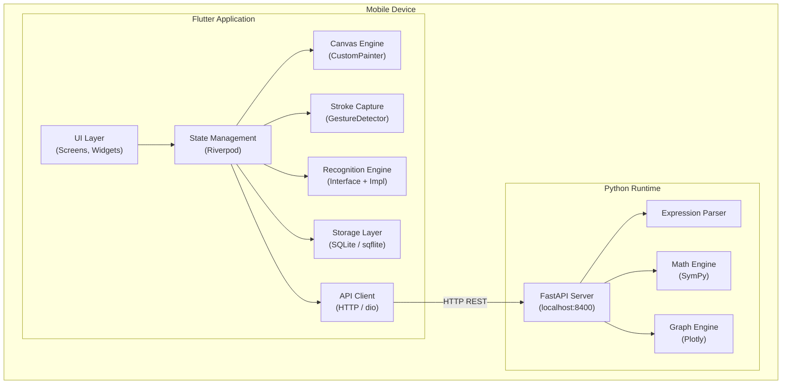
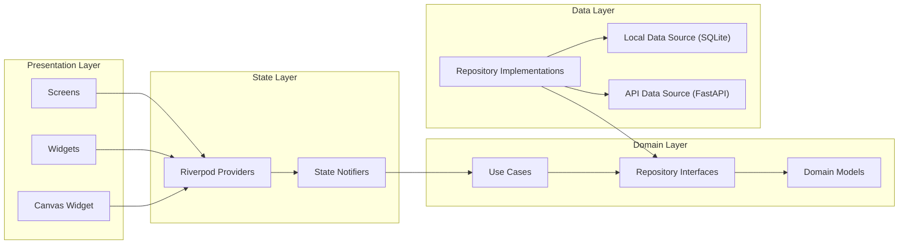
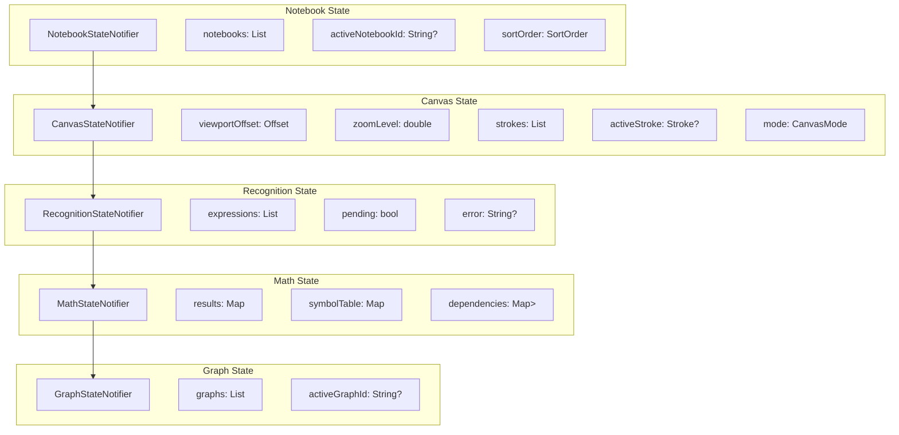
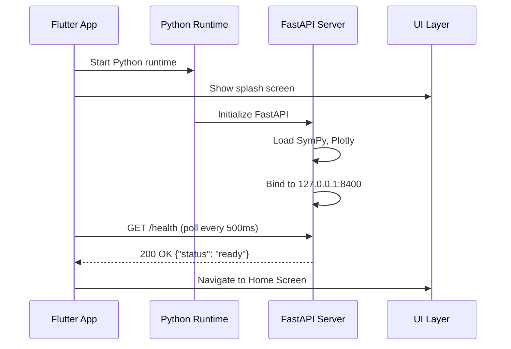
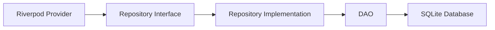
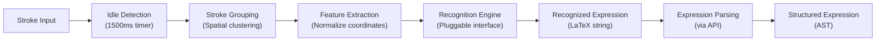
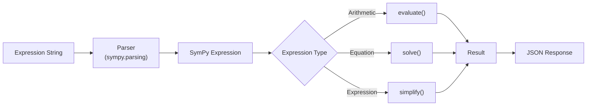
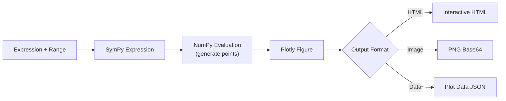
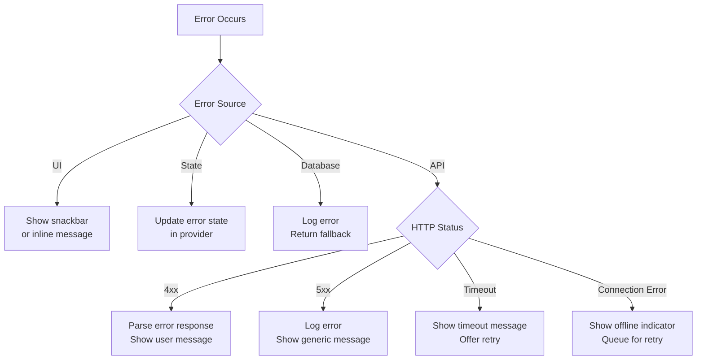
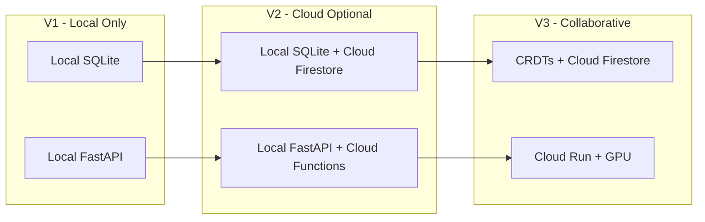

# MathCanvas — Technical Requirements Document (TRD)

**Version:** 1.0
**Status:** Approved
**Last Updated:** 2026-06-12
**Owner:** Engineering
**Audience:** AI Coding Agents, Engineering
**References:** [PRD.md](file:///d:/MathCanvas/PRD.md), [Schema.md](file:///d:/MathCanvas/Schema.md), [Structure.md](file:///d:/MathCanvas/Structure.md)

---

## 1. System Architecture

### 1.1 Architecture Overview

MathCanvas uses a **hybrid local architecture**. The Flutter frontend handles all UI, canvas rendering, stroke capture, and state management. A locally embedded FastAPI (Python) server handles mathematical computation (SymPy) and graph generation (Plotly). Communication between the Flutter app and the local Python server occurs over HTTP on `localhost`.



### 1.2 Key Architecture Decisions

| Decision ID | Decision | Rationale |
|------------|----------|-----------|
| AD-001 | Hybrid Flutter + embedded Python | SymPy and Plotly are Python-only; embedding Python avoids reimplementing math engine. |
| AD-002 | Local REST API (not FFI) | REST is simpler to debug, test, and version than FFI bindings. Latency on localhost is negligible. |
| AD-003 | Riverpod for state management | Compile-safe, testable, supports code generation, and handles async state well. |
| AD-004 | SQLite for storage | Mature, performant, zero-configuration, works offline, widely supported. |
| AD-005 | CustomPainter for canvas | Full control over rendering pipeline; essential for low-latency stroke rendering. |
| AD-006 | Modular recognition interface | Allows swapping recognition backends without affecting other components. |

### 1.3 Communication Protocol

All communication between Flutter and the Python backend uses:

- **Protocol:** HTTP/1.1
- **Host:** `127.0.0.1`
- **Port:** `8400`
- **Format:** JSON
- **Content-Type:** `application/json`
- **Timeout:** 10 seconds (configurable per endpoint)

---

## 2. Component Architecture

### 2.1 Component Dependency Diagram



### 2.2 Component Contracts

Each component communicates through well-defined interfaces (abstract classes in Dart). Implementation details are hidden behind abstractions. This ensures:

1. Components can be tested in isolation.
2. Implementations can be swapped (e.g., recognition engine).
3. AI agents can work on components independently.

---

## 3. Frontend Architecture

### 3.1 Framework and Language

| Attribute | Value |
|-----------|-------|
| Framework | Flutter (latest stable) |
| Language | Dart (latest stable) |
| Min Android SDK | 24 (Android 7.0) |
| Min iOS Version | 14.0 |
| State Management | Riverpod (flutter_riverpod + riverpod_annotation) |
| Navigation | GoRouter |
| HTTP Client | dio |
| Database | sqflite |
| Rendering | CustomPainter |
| Serialization | json_serializable + freezed |

### 3.2 Layer Architecture

The Flutter app follows **Clean Architecture** with four layers:

```
┌─────────────────────────────────────────┐
│           Presentation Layer            │
│    Screens, Widgets, Canvas, Dialogs    │
├─────────────────────────────────────────┤
│           Application Layer             │
│    Riverpod Providers, State Notifiers  │
├─────────────────────────────────────────┤
│             Domain Layer                │
│    Models, Repository Interfaces,       │
│    Use Cases, Value Objects             │
├─────────────────────────────────────────┤
│              Data Layer                 │
│    Repository Impls, Data Sources,      │
│    DTOs, SQLite DAOs, API Client        │
└─────────────────────────────────────────┘
```

### 3.3 State Management Design

#### 3.3.1 Provider Categories

| Category | Provider Type | Purpose | Example |
|----------|-------------|---------|---------|
| Data Providers | `FutureProvider` / `StreamProvider` | Expose repository data | `notebookListProvider` |
| State Providers | `NotifierProvider` / `AsyncNotifierProvider` | Manage mutable state | `canvasStateProvider` |
| Service Providers | `Provider` | Expose singletons and services | `databaseProvider` |
| Family Providers | `Provider.family` | Parameterized providers | `notebookProvider(id)` |

#### 3.3.2 State Architecture



#### 3.3.3 State Immutability

All state objects use `freezed` for immutable data classes with `copyWith` support:

```dart
@freezed
class CanvasState with _$CanvasState {
  const factory CanvasState({
    @Default(Offset.zero) Offset viewportOffset,
    @Default(1.0) double zoomLevel,
    @Default([]) List<Stroke> strokes,
    Stroke? activeStroke,
    @Default(CanvasMode.draw) CanvasMode mode,
  }) = _CanvasState;
}
```

### 3.4 Navigation Architecture

#### 3.4.1 Route Definitions

| Route | Path | Screen | Description |
|-------|------|--------|-------------|
| Home | `/` | `HomeScreen` | Notebook list |
| Canvas | `/notebook/:id` | `CanvasScreen` | Active drawing canvas |

#### 3.4.2 GoRouter Configuration

```dart
final routerProvider = Provider<GoRouter>((ref) {
  return GoRouter(
    initialLocation: '/',
    routes: [
      GoRoute(
        path: '/',
        name: 'home',
        builder: (context, state) => const HomeScreen(),
      ),
      GoRoute(
        path: '/notebook/:id',
        name: 'canvas',
        builder: (context, state) {
          final id = state.pathParameters['id']!;
          return CanvasScreen(notebookId: id);
        },
      ),
    ],
  );
});
```

---

## 4. Backend Architecture

### 4.1 Framework and Language

| Attribute | Value |
|-----------|-------|
| Framework | FastAPI |
| Language | Python 3.11+ |
| Math Engine | SymPy 1.12+ |
| Graph Engine | Plotly 5.18+ |
| Server | Uvicorn |
| Host | 127.0.0.1 |
| Port | 8400 |

### 4.2 Backend Module Structure

```
backend/
├── main.py                  # FastAPI application entry point
├── requirements.txt         # Python dependencies
├── api/
│   ├── __init__.py
│   ├── routes/
│   │   ├── __init__.py
│   │   ├── health.py        # Health check endpoint
│   │   ├── solve.py         # Math solving endpoints
│   │   ├── graph.py         # Graph generation endpoints
│   │   └── parse.py         # Expression parsing endpoints
│   └── models/
│       ├── __init__.py
│       ├── requests.py      # Request DTOs
│       └── responses.py     # Response DTOs
├── engine/
│   ├── __init__.py
│   ├── parser.py            # Expression parser
│   ├── solver.py            # SymPy solver wrapper
│   └── grapher.py           # Plotly graph generator
├── core/
│   ├── __init__.py
│   ├── config.py            # Configuration
│   ├── errors.py            # Custom exceptions
│   └── logging.py           # Logging configuration
└── tests/
    ├── __init__.py
    ├── test_parser.py
    ├── test_solver.py
    ├── test_grapher.py
    └── test_api.py
```

### 4.3 Embedding Strategy

#### 4.3.1 Android

- **Tool:** Chaquopy (Gradle plugin)
- **Mechanism:** Embeds Python interpreter within the APK. FastAPI server starts as a background thread on app launch.
- **Startup:** Python server initializes in parallel with Flutter UI. Health check endpoint confirms readiness.

#### 4.3.2 iOS

- **Tool:** Python-Apple-support or PythonKit
- **Mechanism:** Bundles Python.framework with the app. FastAPI runs in a background thread.
- **Startup:** Same as Android — parallel initialization with health check.

#### 4.3.3 Startup Sequence



---

## 5. Storage Architecture

### 5.1 Storage Overview

| Storage Type | Technology | Purpose |
|-------------|-----------|---------|
| Structured Data | SQLite (sqflite) | Notebooks, strokes, expressions, results |
| Preferences | SharedPreferences | App settings, theme, last opened notebook |

### 5.2 SQLite Configuration

| Parameter | Value |
|-----------|-------|
| Database File | `mathcanvas.db` |
| WAL Mode | Enabled |
| Foreign Keys | Enabled |
| Journal Mode | WAL |
| Synchronous | NORMAL |
| Cache Size | 2000 pages |

### 5.3 Data Access Pattern



All database operations go through:
1. **Repository interface** (domain layer) — defines the contract.
2. **Repository implementation** (data layer) — implements the contract.
3. **DAO** (data layer) — executes raw SQL queries.

Detailed schema definition: [Schema.md](file:///d:/MathCanvas/Schema.md).

---

## 6. Recognition Architecture

### 6.1 Recognition Pipeline



### 6.2 Recognition Interface

```dart
abstract class RecognitionEngine {
  /// Initialize the engine (load models, etc.)
  Future<void> initialize();

  /// Recognize mathematical symbols from a list of strokes.
  /// Returns a list of recognized expressions with confidence scores.
  Future<List<RecognitionResult>> recognize(List<Stroke> strokes);

  /// Release resources.
  Future<void> dispose();
}

class RecognitionResult {
  final String latex;
  final double confidence;
  final Rect boundingBox;
  final List<String> strokeIds;
}
```

### 6.3 Stroke Grouping Algorithm

Strokes are grouped into expression clusters using spatial proximity:

1. Compute bounding box for each stroke.
2. Merge bounding boxes that overlap or are within `groupingThreshold` pixels (default: 50px in world coordinates).
3. Each merged group becomes a recognition candidate.
4. Groups are sent to the recognition engine independently.

### 6.4 V1 Recognition Implementation

For V1, recognition uses a **rule-based recognizer** with the following approach:

1. **Individual character recognition** using a pre-trained TensorFlow Lite model (MNIST-extended for math symbols).
2. **Spatial layout analysis** to determine structural relationships (superscript, subscript, fraction).
3. **Expression assembly** using grammar rules.

The recognition interface allows this to be replaced with more advanced ML models in future versions without changing the rest of the pipeline.

### 6.5 Recognition Scope (V1)

| Category | Symbols |
|----------|---------|
| Digits | 0, 1, 2, 3, 4, 5, 6, 7, 8, 9 |
| Variables | a–z, A–Z |
| Operators | +, −, ×, ÷, = |
| Grouping | (, ) |
| Special | . (decimal), fraction bar |
| Structure | Superscript (exponents) |
| Functions | sin, cos, tan (recognized as character sequences) |

---

## 7. Math Engine Architecture

### 7.1 Engine Design

The math engine is a Python module that wraps SymPy operations behind a clean API.



### 7.2 Supported Operations

| Operation | SymPy Function | Input Example | Output Example |
|-----------|---------------|---------------|----------------|
| Arithmetic evaluation | `sympify().evalf()` | `2 + 3 * 4` | `14` |
| Algebraic solving | `solve()` | `2*x + 4 - 8` | `[2]` |
| Symbolic simplification | `simplify()` | `x**2 + 2*x + 1` | `(x + 1)**2` |
| Trigonometric evaluation | `sympify().evalf()` | `sin(pi/4)` | `0.7071...` |
| Polynomial expansion | `expand()` | `(x+1)**3` | `x**3 + 3*x**2 + 3*x + 1` |
| Factoring | `factor()` | `x**2 - 1` | `(x-1)*(x+1)` |

### 7.3 API Endpoints

#### 7.3.1 POST /api/v1/solve

**Request:**
```json
{
  "expression": "2*x + 4 = 8",
  "variables": ["x"],
  "operation": "solve"
}
```

**Response:**
```json
{
  "success": true,
  "result": {
    "type": "solution",
    "solutions": [{"variable": "x", "value": "2"}],
    "latex": "x = 2",
    "numeric": 2.0
  },
  "computation_time_ms": 45
}
```

#### 7.3.2 POST /api/v1/evaluate

**Request:**
```json
{
  "expression": "2 + 3 * 4"
}
```

**Response:**
```json
{
  "success": true,
  "result": {
    "type": "numeric",
    "value": "14",
    "latex": "14",
    "numeric": 14.0
  },
  "computation_time_ms": 12
}
```

#### 7.3.3 POST /api/v1/simplify

**Request:**
```json
{
  "expression": "x**2 + 2*x + 1"
}
```

**Response:**
```json
{
  "success": true,
  "result": {
    "type": "expression",
    "value": "(x + 1)**2",
    "latex": "\\left(x + 1\\right)^{2}",
    "numeric": null
  },
  "computation_time_ms": 23
}
```

### 7.4 Error Responses

```json
{
  "success": false,
  "error": {
    "code": "PARSE_ERROR",
    "message": "Unable to parse expression: invalid syntax at position 5",
    "details": {
      "expression": "2x ++ 4",
      "position": 5
    }
  },
  "computation_time_ms": 3
}
```

### 7.5 Error Codes

| Code | HTTP Status | Description |
|------|-------------|-------------|
| `PARSE_ERROR` | 422 | Expression cannot be parsed |
| `SOLVE_ERROR` | 422 | Equation cannot be solved |
| `TIMEOUT` | 408 | Computation exceeded time limit |
| `UNSUPPORTED_OPERATION` | 400 | Requested operation not supported |
| `INTERNAL_ERROR` | 500 | Unexpected server error |

---

## 8. Graph Engine Architecture

### 8.1 Engine Design



### 8.2 API Endpoint

#### POST /api/v1/graph

**Request:**
```json
{
  "expression": "x**2 - 4",
  "variable": "x",
  "x_range": [-10, 10],
  "num_points": 500,
  "output_format": "data",
  "style": {
    "title": "y = x² - 4",
    "color": "#6366f1",
    "show_grid": true,
    "show_axes": true
  }
}
```

**Response (data format):**
```json
{
  "success": true,
  "result": {
    "type": "graph",
    "data": {
      "x": [-10, -9.96, ...],
      "y": [96, 95.2, ...],
      "x_label": "x",
      "y_label": "y",
      "title": "y = x² - 4"
    },
    "html": null,
    "image_base64": null
  },
  "computation_time_ms": 120
}
```

**Response (html format):**
```json
{
  "success": true,
  "result": {
    "type": "graph",
    "data": null,
    "html": "<html>...(interactive Plotly chart)...</html>",
    "image_base64": null
  },
  "computation_time_ms": 250
}
```

### 8.3 Graph Rendering in Flutter

For V1, graphs are rendered in Flutter using one of two strategies:

1. **Primary (data format):** Plot data points are returned as JSON. Flutter renders the graph using a `CustomPainter`-based chart widget for native performance and consistent UX.
2. **Fallback (html format):** Full Plotly HTML is loaded in a `WebView` widget for complex interactivity.

The `output_format` parameter controls which strategy is used.

### 8.4 Supported Graph Types

| Type | Expression Pattern | Example |
|------|-------------------|---------|
| Linear | `a*x + b` | `y = 2*x + 3` |
| Quadratic | `a*x**2 + b*x + c` | `y = x**2 - 4` |
| Polynomial | Degree ≤ 10 | `y = x**3 + 2*x + 1` |
| Trigonometric | `sin`, `cos`, `tan` | `y = sin(x)` |
| Composite | Combinations of above | `y = x**2 + sin(x)` |

---

## 9. API Design

### 9.1 Full API Reference

| Method | Path | Purpose | Timeout |
|--------|------|---------|---------|
| GET | `/health` | Server readiness check | 2s |
| GET | `/api/v1/info` | Server version and capabilities | 2s |
| POST | `/api/v1/parse` | Parse expression string to structured form | 5s |
| POST | `/api/v1/evaluate` | Evaluate arithmetic expression | 5s |
| POST | `/api/v1/solve` | Solve equation for variables | 10s |
| POST | `/api/v1/simplify` | Simplify symbolic expression | 10s |
| POST | `/api/v1/graph` | Generate graph data or visualization | 10s |

### 9.2 Common Response Envelope

Every API response follows this structure:

```json
{
  "success": true | false,
  "result": { ... } | null,
  "error": { "code": "...", "message": "...", "details": {} } | null,
  "computation_time_ms": 45
}
```

### 9.3 Health Check

#### GET /health

**Response:**
```json
{
  "status": "ready",
  "version": "1.0.0",
  "uptime_seconds": 142.5
}
```

### 9.4 API Versioning

- All endpoints are prefixed with `/api/v1/`.
- Future breaking changes will use `/api/v2/`.
- Non-breaking additions (new fields, new optional parameters) do not require version increment.

---

## 10. Folder Structure Overview

Detailed in [Structure.md](file:///d:/MathCanvas/Structure.md). Summary:

```
MathCanvas/
├── frontend/                      # Flutter application
│   ├── lib/
│   │   ├── app/                   # App configuration, router, theme
│   │   ├── core/                  # Shared utilities, constants, extensions
│   │   ├── features/              # Feature modules
│   │   │   ├── canvas/            # Canvas engine, stroke capture
│   │   │   ├── recognition/       # Handwriting recognition
│   │   │   ├── math_engine/       # Math solving integration
│   │   │   ├── graph/             # Graph display
│   │   │   └── notebook/          # Notebook management
│   │   └── shared/                # Shared widgets, models
│   ├── test/                      # Test files (mirror lib/ structure)
│   ├── assets/                    # Static assets
│   └── pubspec.yaml
├── backend/                       # FastAPI application
│   ├── api/                       # API routes and models
│   ├── engine/                    # Math and graph engines
│   ├── core/                      # Configuration, errors, logging
│   ├── tests/                     # Python tests
│   ├── main.py
│   └── requirements.txt
├── docs/                          # Project documentation
│   ├── PRD.md
│   ├── TRD.md
│   ├── AppFlow.md
│   ├── Schema.md
│   ├── ImplementationPlan.md
│   ├── Tracker.md
│   ├── Rules.md
│   ├── UI_UX.md
│   └── Structure.md
└── README.md
```

---

## 11. Error Handling

### 11.1 Error Handling Strategy



### 11.2 Error Categories

| Category | Handling Strategy | User Impact |
|----------|------------------|-------------|
| **Input Validation** | Prevent at UI level | None — invalid actions are disabled |
| **Recognition Failure** | Show low-confidence indicator | User sees "?" marker on unrecognized content |
| **Parse Error** | Display error near expression | User sees "Cannot parse" message |
| **Solve Error** | Display error near expression | User sees "Cannot solve" message |
| **Database Error** | Log, retry, fallback | User sees auto-save failure indicator |
| **API Connection Error** | Retry 3 times, then show error | User sees "Math engine unavailable" |
| **API Timeout** | Cancel, show timeout message | User sees "Calculation timed out" |

### 11.3 Error Propagation Rules

1. **Never swallow errors silently.** Every error must be either logged, displayed, or both.
2. **Never crash the app.** All errors must be caught and handled gracefully.
3. **Always preserve user data.** Database errors must not cause data loss.
4. **Log all errors** with context (timestamp, operation, input, stack trace).

---

## 12. Logging Strategy

### 12.1 Frontend Logging

| Level | Usage | Example |
|-------|-------|---------|
| `FINE` | Verbose debug info | Stroke point coordinates |
| `INFO` | Normal operations | "Notebook opened: {id}" |
| `WARNING` | Unexpected but recoverable | "Recognition confidence below threshold" |
| `SEVERE` | Errors requiring attention | "Database write failed" |

**Implementation:** Use Dart's `logging` package with a structured logger.

```dart
final log = Logger('CanvasEngine');
log.info('Stroke captured: ${stroke.id}, points: ${stroke.points.length}');
```

### 12.2 Backend Logging

| Level | Usage | Example |
|-------|-------|---------|
| `DEBUG` | Verbose debug info | "Parsing expression: 2*x + 4" |
| `INFO` | Request/response logging | "POST /api/v1/solve - 200 - 45ms" |
| `WARNING` | Non-critical issues | "Computation near timeout: 8.5s" |
| `ERROR` | Failed operations | "SymPy solve() raised ValueError" |

**Implementation:** Use Python's `logging` module with structured JSON output.

```python
logger = logging.getLogger("mathcanvas.solver")
logger.info("Solving equation", extra={"expression": expr, "variables": vars})
```

### 12.3 Log Storage

- **Frontend:** Logs stored in-memory ring buffer (last 1000 entries). Debug builds write to console.
- **Backend:** Logs written to stdout (captured by app container).
- **Production:** No remote logging in V1. Logs are device-local only.

---

## 13. Security Considerations

### 13.1 V1 Security Model

Since V1 is offline-only with no network communication, no authentication, and no user accounts, the security surface is minimal.

| Concern | Mitigation |
|---------|-----------|
| Local API exposure | FastAPI binds to `127.0.0.1` only — not accessible from network. |
| Arbitrary code execution via SymPy | Input is parsed through expression parser; raw `eval()` is never used. SymPy's `sympify()` with `evaluate=False` prevents code injection. |
| SQL injection | All database queries use parameterized statements via sqflite. No raw string concatenation. |
| Data privacy | All data stored locally. No telemetry, analytics, or data transmission in V1. |
| Malicious expressions | Computation timeout (10s) prevents denial-of-service from complex expressions. |
| Input validation | All API inputs are validated via Pydantic models before processing. |

### 13.2 Expression Sanitization

```python
# NEVER do this:
result = eval(user_input)  # FORBIDDEN

# ALWAYS do this:
from sympy.parsing.sympy_parser import parse_expr
from sympy.parsing.sympy_parser import standard_transformations, implicit_multiplication
expr = parse_expr(
    sanitized_input,
    transformations=standard_transformations + (implicit_multiplication,),
    evaluate=False
)
```

### 13.3 Future Security Considerations

When V2 introduces cloud sync and user accounts:
- HTTPS for all network communication.
- OAuth 2.0 or Firebase Auth for authentication.
- Server-side input validation.
- Rate limiting on API endpoints.
- Encrypted local storage for sensitive data.

---

## 14. Performance Targets

### 14.1 Performance Budget

| Metric | Target | Critical Threshold | Measurement |
|--------|--------|-------------------|-------------|
| Stroke render latency | < 8ms | < 16ms (60fps) | Frame timing |
| Canvas pan/zoom FPS | ≥ 60fps | ≥ 30fps | Frame counter |
| Stroke-to-recognition latency | < 500ms | < 1000ms | Timer from idle trigger to result |
| API round-trip (evaluate) | < 200ms | < 500ms | HTTP request timing |
| API round-trip (solve) | < 1s | < 2s | HTTP request timing |
| API round-trip (graph) | < 2s | < 3s | HTTP request timing |
| App cold start | < 2s | < 3s | Process start to interactive |
| Python server startup | < 5s | < 8s | Bind to port timing |
| Database query (load notebook) | < 100ms | < 500ms | Query profiling |
| Database write (save stroke) | < 10ms | < 50ms | Write profiling |
| Memory (Flutter) | < 150MB | < 250MB | Memory profiling |
| Memory (Python) | < 100MB | < 200MB | Memory profiling |
| APK size | < 100MB | < 150MB | Build output |

### 14.2 Performance Optimization Strategies

| Strategy | Component | Details |
|----------|-----------|---------|
| Viewport culling | Canvas | Only render strokes within visible viewport + margin. |
| Spatial indexing | Canvas | Use R-tree or grid-based index for fast viewport queries. |
| Stroke simplification | Canvas | Reduce point density for zoomed-out views (Douglas-Peucker). |
| Batch rendering | Canvas | Group strokes into `Picture` objects; cache rendered layers. |
| Debounce recognition | Recognition | Wait for idle period before triggering recognition. |
| Cache results | Math Engine | Cache solve results keyed by expression hash. |
| Lazy loading | Notebook | Load strokes in viewport first; load rest in background. |
| WAL mode | SQLite | Enable WAL for concurrent read/write performance. |
| Connection pooling | API Client | Reuse HTTP connections to local server. |

---

## 15. Scalability Considerations

### 15.1 Current Architecture Limits

| Dimension | V1 Limit | Bottleneck |
|-----------|----------|-----------|
| Strokes per notebook | ~10,000 | Canvas rendering performance |
| Notebooks | ~500 | SQLite file size, list UI performance |
| Points per stroke | ~5,000 | Memory per stroke object |
| Concurrent computations | 1 (sequential) | Single-threaded Python server |
| Expression complexity | SymPy default limits | Computation timeout |

### 15.2 Future Scalability Path



### 15.3 Scalability Design Decisions

| Decision | Rationale | Future Impact |
|----------|-----------|--------------|
| Repository pattern for data access | Swap SQLite for Firestore without changing domain logic. | Cloud sync in V2 requires only new repository implementation. |
| API client abstraction | Swap local server for cloud endpoint. | Cloud compute in V2 requires only URL change + auth headers. |
| Modular recognition engine | Swap TFLite model for cloud ML model. | Better recognition in V2 without pipeline changes. |
| Expression IDs use UUIDs | Globally unique identifiers work across devices. | Collaboration in V3 requires no ID schema change. |
| Stroke data is append-only | Compatible with CRDTs for conflict resolution. | Collaboration in V3 can merge stroke histories. |

---

## 16. Technology Dependency Matrix

| Component | Package | Version | Purpose | License |
|-----------|---------|---------|---------|---------|
| **Flutter** | flutter | stable | UI framework | BSD-3 |
| **Riverpod** | flutter_riverpod | ^2.5 | State management | MIT |
| **GoRouter** | go_router | ^14.0 | Navigation | BSD-3 |
| **sqflite** | sqflite | ^2.3 | SQLite database | MIT |
| **dio** | dio | ^5.4 | HTTP client | MIT |
| **freezed** | freezed | ^2.5 | Immutable data classes | MIT |
| **json_serializable** | json_serializable | ^6.8 | JSON serialization | BSD-3 |
| **uuid** | uuid | ^4.3 | UUID generation | MIT |
| **path_provider** | path_provider | ^2.1 | File system paths | BSD-3 |
| **FastAPI** | fastapi | ^0.111 | REST API framework | MIT |
| **Uvicorn** | uvicorn | ^0.30 | ASGI server | BSD-3 |
| **SymPy** | sympy | ^1.12 | Symbolic mathematics | BSD-3 |
| **Plotly** | plotly | ^5.22 | Graph generation | MIT |
| **NumPy** | numpy | ^1.26 | Numerical computation | BSD-3 |
| **Pydantic** | pydantic | ^2.7 | Data validation | MIT |

---

*End of TRD.md*
